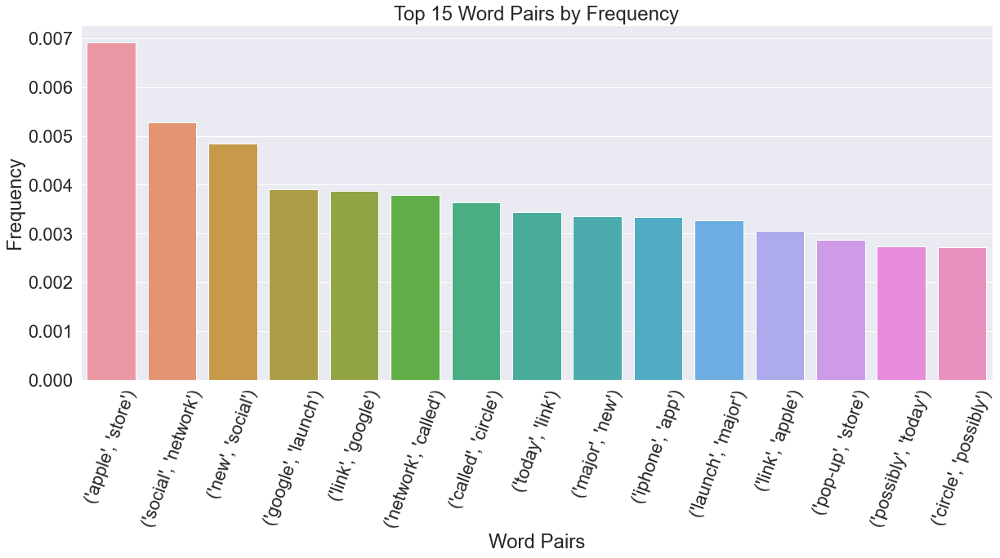
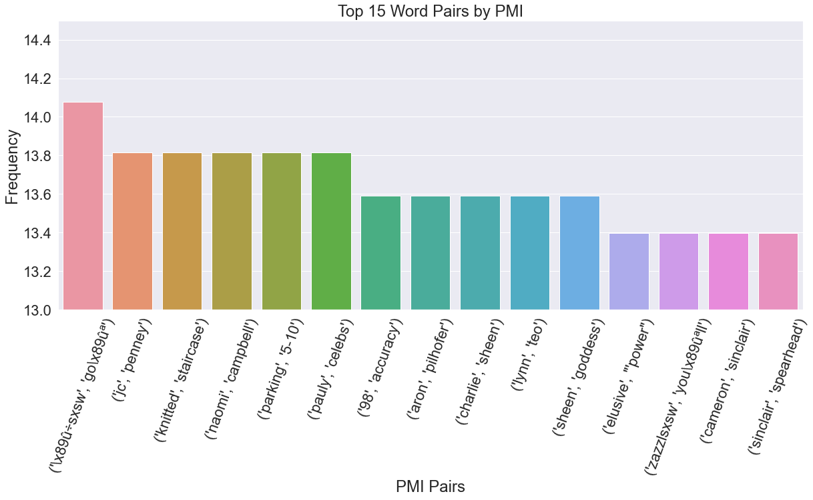
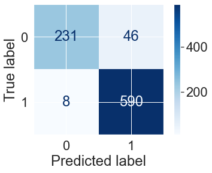
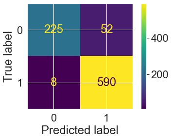
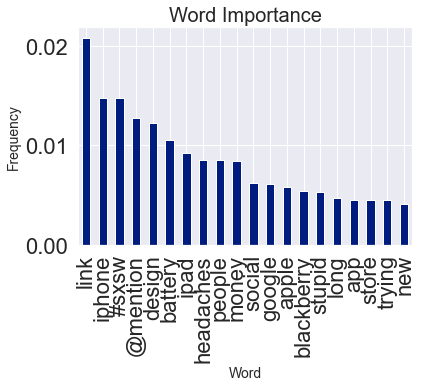

### EDA, Preprocessing, and Tweet Analysis Notebook


```python
import numpy as np
import pandas as pd
import spacy
import re
import nltk
import matplotlib.pyplot as plt
import logging
logging.basicConfig(format='%(asctime)s : %(levelname)s : %(message)s', level=logging.INFO)
from gensim.models import Word2Vec
from keras.models import Sequential
from keras.layers import Dense
from sklearn.preprocessing import MinMaxScaler, MaxAbsScaler
import seaborn as sns

from nltk.stem.wordnet import WordNetLemmatizer
import string
nltk.download('stopwords')
nltk.download('punkt')
nltk.download('wordnet')
from sklearn.pipeline import Pipeline
from nltk.corpus import stopwords
from nltk import word_tokenize, FreqDist
from applesauce import model_scoring, cost_benefit_analysis, evaluate_model
from applesauce import model_opt, single_model_opt

from sklearn.metrics import classification_report, confusion_matrix, plot_confusion_matrix, accuracy_score, precision_recall_curve, f1_score, precision_score, recall_score
from sklearn.ensemble import RandomForestClassifier, AdaBoostClassifier, GradientBoostingClassifier 
from sklearn.naive_bayes import BernoulliNB, CategoricalNB, GaussianNB, MultinomialNB
from sklearn.feature_extraction.text import TfidfVectorizer,CountVectorizer, TfidfTransformer
from sklearn.model_selection import GridSearchCV, train_test_split

from keras.preprocessing.sequence import pad_sequences
from keras.layers import Input, Dense, LSTM, Embedding
from keras.layers import Dropout, Activation, Bidirectional, GlobalMaxPool1D
from keras.models import Sequential
from keras import initializers, regularizers, constraints, optimizers, layers
from keras.preprocessing import text, sequence
```

    [nltk_data] Downloading package stopwords to
    [nltk_data]     C:\Users\josep\AppData\Roaming\nltk_data...
    [nltk_data]   Package stopwords is already up-to-date!
    [nltk_data] Downloading package punkt to
    [nltk_data]     C:\Users\josep\AppData\Roaming\nltk_data...
    [nltk_data]   Package punkt is already up-to-date!
    [nltk_data] Downloading package wordnet to
    [nltk_data]     C:\Users\josep\AppData\Roaming\nltk_data...
    [nltk_data]   Package wordnet is already up-to-date!
    


```python
nlp = spacy.load('en_core_web_sm')
```


```python
print(stopwords)
print(nlp.Defaults.stop_words)
```

    <WordListCorpusReader in '.../corpora/stopwords' (not loaded yet)>
    {'none', 'hereafter', 'we', 'anyhow', 'how', 'such', 'before', 'enough', 'towards', 'do', 'must', 'everything', 'done', 'now', 'this', 'whole', 'beyond', 'whom', 'however', "'re", 'have', 'too', 'our', 'toward', 'somewhere', 'therein', 'themselves', 'two', 'empty', 'hereupon', 'until', 'move', 'anything', 'a', 'that', 'used', 'front', 'might', 'nine', 'whence', 'above', 'during', 'at', 'him', 'using', 'but', 'yourself', 'therefore', 'often', 'say', 'been', 'various', 'please', 'doing', 'thereupon', 'beside', 'every', 'really', 'four', '‘re', 'someone', 'give', 'several', 'never', 'these', 'only', 'into', 'quite', 'yourselves', 'there', 'thus', 'more', 'elsewhere', 'besides', 'in', 'whatever', 'became', 'fifteen', 'of', 'latter', 'among', 'anywhere', 'may', 'who', 'hers', 'with', 'call', 'whereupon', 'others', 'hence', 'mostly', 'i', 'your', 'about', 'along', 'becoming', 'across', 'were', 'though', 'ours', 'through', 'become', 'get', 'three', 'n‘t', 'than', 'regarding', 'once', 'somehow', 'already', 'thereafter', 'due', 'few', 'whether', "'s", 'whereas', 'all', 'their', 'whenever', 'an', 'less', 'the', 'you', 'why', 'together', 'between', 'ten', 'are', 'any', 'had', 'nowhere', 'eight', 'over', 'another', 'beforehand', 'whither', 'otherwise', 'everyone', 'unless', 'name', 'being', '’ll', 'part', 'then', 'when', 'himself', 'throughout', 'fifty', '‘m', 'wherever', 'below', 'formerly', 'further', 'if', 'me', 'hundred', 'forty', 'indeed', 'last', 'because', 'what', 'becomes', 'one', 'nor', 'after', 'herself', 'off', 'her', 'some', 'whereby', 'no', 'top', '‘ll', 'amongst', 'even', 'or', 'as', 'either', 'full', 'meanwhile', 'same', 'much', 'under', 'afterwards', 'they', 'well', 'make', 'thereby', 'former', 'amount', "'ve", 'out', 'always', 'where', 'something', 'was', 'rather', 'will', 'also', "'ll", 'us', 'whereafter', 'many', 'could', 'go', 'alone', 'hereby', 'not', '’m', '‘ve', 'twelve', 'by', 'without', 'almost', 'serious', 'nobody', 'up', 'to', 'very', 'he', 'everywhere', 'see', 'so', 'she', 'moreover', 'behind', 'eleven', 'just', 'my', 'else', 'seems', 'anyway', 'put', 'is', 'next', "'d", '’re', 'five', 'six', 'onto', "'m", 'neither', 'per', 'on', 'sixty', 'within', 'latterly', 're', 'am', 'it', 'n’t', 'nothing', 'anyone', 'its', 'thence', 'and', '’s', 'side', 'third', '‘d', 'would', 'least', 'those', 'seemed', 'upon', 'around', 'can', 'ca', 'sometimes', 'show', 'mine', 'cannot', 'seeming', 'ourselves', 'namely', "n't", 'each', '’d', 'which', 'except', 'itself', 'while', 'for', 'has', 'against', 'noone', 'whose', 'yet', 'made', 'although', 'does', 'perhaps', 'own', '’ve', 'bottom', 'most', '‘s', 'myself', 'take', 'from', 'back', 'sometime', 'again', 'ever', 'keep', 'be', 'thru', 'still', 'both', 'nevertheless', 'via', 'down', 'wherein', 'seem', 'did', 'his', 'herein', 'other', 'them', 'here', 'twenty', 'whoever', 'yours', 'since', 'should', 'first'}
    


```python
df = pd.read_csv('data/product_tweets.csv',encoding='latin1')
```


```python
df.head()
```


<div>
<style scoped>
    .dataframe tbody tr th:only-of-type {
        vertical-align: middle;
    }

    .dataframe tbody tr th {
        vertical-align: top;
    }

    .dataframe thead th {
        text-align: right;
    }
</style>
<table border="1" class="dataframe">
  <thead>
    <tr style="text-align: right;">
      <th></th>
      <th>tweet_text</th>
      <th>emotion_in_tweet_is_directed_at</th>
      <th>is_there_an_emotion_directed_at_a_brand_or_product</th>
    </tr>
  </thead>
  <tbody>
    <tr>
      <th>0</th>
      <td>.@wesley83 I have a 3G iPhone. After 3 hrs twe...</td>
      <td>iPhone</td>
      <td>Negative emotion</td>
    </tr>
    <tr>
      <th>1</th>
      <td>@jessedee Know about @fludapp ? Awesome iPad/i...</td>
      <td>iPad or iPhone App</td>
      <td>Positive emotion</td>
    </tr>
    <tr>
      <th>2</th>
      <td>@swonderlin Can not wait for #iPad 2 also. The...</td>
      <td>iPad</td>
      <td>Positive emotion</td>
    </tr>
    <tr>
      <th>3</th>
      <td>@sxsw I hope this year's festival isn't as cra...</td>
      <td>iPad or iPhone App</td>
      <td>Negative emotion</td>
    </tr>
    <tr>
      <th>4</th>
      <td>@sxtxstate great stuff on Fri #SXSW: Marissa M...</td>
      <td>Google</td>
      <td>Positive emotion</td>
    </tr>
  </tbody>
</table>
</div>


```python
df['is_there_an_emotion_directed_at_a_brand_or_product'].unique()
```


    array(['Negative emotion', 'Positive emotion',
           'No emotion toward brand or product', "I can't tell"], dtype=object)


```python
df = df.rename(columns= {'is_there_an_emotion_directed_at_a_brand_or_product'
                         :'Emotion','emotion_in_tweet_is_directed_at': 'Platform'})
```


```python
df = df.rename(columns= {'tweet_text': 'Tweet'})
```


```python
df.head() # want to remove the @'name' in the tweet 
```


<div>
<style scoped>
    .dataframe tbody tr th:only-of-type {
        vertical-align: middle;
    }

    .dataframe tbody tr th {
        vertical-align: top;
    }

    .dataframe thead th {
        text-align: right;
    }
</style>
<table border="1" class="dataframe">
  <thead>
    <tr style="text-align: right;">
      <th></th>
      <th>Tweet</th>
      <th>Platform</th>
      <th>Emotion</th>
    </tr>
  </thead>
  <tbody>
    <tr>
      <th>0</th>
      <td>.@wesley83 I have a 3G iPhone. After 3 hrs twe...</td>
      <td>iPhone</td>
      <td>Negative emotion</td>
    </tr>
    <tr>
      <th>1</th>
      <td>@jessedee Know about @fludapp ? Awesome iPad/i...</td>
      <td>iPad or iPhone App</td>
      <td>Positive emotion</td>
    </tr>
    <tr>
      <th>2</th>
      <td>@swonderlin Can not wait for #iPad 2 also. The...</td>
      <td>iPad</td>
      <td>Positive emotion</td>
    </tr>
    <tr>
      <th>3</th>
      <td>@sxsw I hope this year's festival isn't as cra...</td>
      <td>iPad or iPhone App</td>
      <td>Negative emotion</td>
    </tr>
    <tr>
      <th>4</th>
      <td>@sxtxstate great stuff on Fri #SXSW: Marissa M...</td>
      <td>Google</td>
      <td>Positive emotion</td>
    </tr>
  </tbody>
</table>
</div>


```python
df_dummify = pd.get_dummies(df['Emotion'])
```


```python
df_dummify.head()
```


<div>
<style scoped>
    .dataframe tbody tr th:only-of-type {
        vertical-align: middle;
    }

    .dataframe tbody tr th {
        vertical-align: top;
    }

    .dataframe thead th {
        text-align: right;
    }
</style>
<table border="1" class="dataframe">
  <thead>
    <tr style="text-align: right;">
      <th></th>
      <th>I can't tell</th>
      <th>Negative emotion</th>
      <th>No emotion toward brand or product</th>
      <th>Positive emotion</th>
    </tr>
  </thead>
  <tbody>
    <tr>
      <th>0</th>
      <td>0</td>
      <td>1</td>
      <td>0</td>
      <td>0</td>
    </tr>
    <tr>
      <th>1</th>
      <td>0</td>
      <td>0</td>
      <td>0</td>
      <td>1</td>
    </tr>
    <tr>
      <th>2</th>
      <td>0</td>
      <td>0</td>
      <td>0</td>
      <td>1</td>
    </tr>
    <tr>
      <th>3</th>
      <td>0</td>
      <td>1</td>
      <td>0</td>
      <td>0</td>
    </tr>
    <tr>
      <th>4</th>
      <td>0</td>
      <td>0</td>
      <td>0</td>
      <td>1</td>
    </tr>
  </tbody>
</table>
</div>


```python
df_dummify.sum() # class bias 
```


    I can't tell                           156
    Negative emotion                       570
    No emotion toward brand or product    5389
    Positive emotion                      2978
    dtype: int64


```python
df.info()
df = pd.merge(df, df_dummify, how='outer',on=df.index) # ran this code, dummify emotion data
```

    <class 'pandas.core.frame.DataFrame'>
    RangeIndex: 9093 entries, 0 to 9092
    Data columns (total 3 columns):
     #   Column    Non-Null Count  Dtype 
    ---  ------    --------------  ----- 
     0   Tweet     9092 non-null   object
     1   Platform  3291 non-null   object
     2   Emotion   9093 non-null   object
    dtypes: object(3)
    memory usage: 213.2+ KB
    


```python
df.info()
```

    <class 'pandas.core.frame.DataFrame'>
    Int64Index: 9093 entries, 0 to 9092
    Data columns (total 8 columns):
     #   Column                              Non-Null Count  Dtype 
    ---  ------                              --------------  ----- 
     0   key_0                               9093 non-null   int64 
     1   Tweet                               9092 non-null   object
     2   Platform                            3291 non-null   object
     3   Emotion                             9093 non-null   object
     4   I can't tell                        9093 non-null   uint8 
     5   Negative emotion                    9093 non-null   uint8 
     6   No emotion toward brand or product  9093 non-null   uint8 
     7   Positive emotion                    9093 non-null   uint8 
    dtypes: int64(1), object(3), uint8(4)
    memory usage: 390.7+ KB
    


```python
df.head()
```


<div>
<style scoped>
    .dataframe tbody tr th:only-of-type {
        vertical-align: middle;
    }

    .dataframe tbody tr th {
        vertical-align: top;
    }

    .dataframe thead th {
        text-align: right;
    }
</style>
<table border="1" class="dataframe">
  <thead>
    <tr style="text-align: right;">
      <th></th>
      <th>key_0</th>
      <th>Tweet</th>
      <th>Platform</th>
      <th>Emotion</th>
      <th>I can't tell</th>
      <th>Negative emotion</th>
      <th>No emotion toward brand or product</th>
      <th>Positive emotion</th>
    </tr>
  </thead>
  <tbody>
    <tr>
      <th>0</th>
      <td>0</td>
      <td>.@wesley83 I have a 3G iPhone. After 3 hrs twe...</td>
      <td>iPhone</td>
      <td>Negative emotion</td>
      <td>0</td>
      <td>1</td>
      <td>0</td>
      <td>0</td>
    </tr>
    <tr>
      <th>1</th>
      <td>1</td>
      <td>@jessedee Know about @fludapp ? Awesome iPad/i...</td>
      <td>iPad or iPhone App</td>
      <td>Positive emotion</td>
      <td>0</td>
      <td>0</td>
      <td>0</td>
      <td>1</td>
    </tr>
    <tr>
      <th>2</th>
      <td>2</td>
      <td>@swonderlin Can not wait for #iPad 2 also. The...</td>
      <td>iPad</td>
      <td>Positive emotion</td>
      <td>0</td>
      <td>0</td>
      <td>0</td>
      <td>1</td>
    </tr>
    <tr>
      <th>3</th>
      <td>3</td>
      <td>@sxsw I hope this year's festival isn't as cra...</td>
      <td>iPad or iPhone App</td>
      <td>Negative emotion</td>
      <td>0</td>
      <td>1</td>
      <td>0</td>
      <td>0</td>
    </tr>
    <tr>
      <th>4</th>
      <td>4</td>
      <td>@sxtxstate great stuff on Fri #SXSW: Marissa M...</td>
      <td>Google</td>
      <td>Positive emotion</td>
      <td>0</td>
      <td>0</td>
      <td>0</td>
      <td>1</td>
    </tr>
  </tbody>
</table>
</div>


```python
df = df.rename(columns = {"I can't tell": "Uncertain", 'Negative emotion': 'Negative'
                          , 'No emotion toward brand or product': 'No Emotion'
                          , 'Positive emotion':'Positive'})
```


```python
df = df.drop(columns='key_0')
df.head()
```


<div>
<style scoped>
    .dataframe tbody tr th:only-of-type {
        vertical-align: middle;
    }

    .dataframe tbody tr th {
        vertical-align: top;
    }

    .dataframe thead th {
        text-align: right;
    }
</style>
<table border="1" class="dataframe">
  <thead>
    <tr style="text-align: right;">
      <th></th>
      <th>Tweet</th>
      <th>Platform</th>
      <th>Emotion</th>
      <th>Uncertain</th>
      <th>Negative</th>
      <th>No Emotion</th>
      <th>Positive</th>
    </tr>
  </thead>
  <tbody>
    <tr>
      <th>0</th>
      <td>.@wesley83 I have a 3G iPhone. After 3 hrs twe...</td>
      <td>iPhone</td>
      <td>Negative emotion</td>
      <td>0</td>
      <td>1</td>
      <td>0</td>
      <td>0</td>
    </tr>
    <tr>
      <th>1</th>
      <td>@jessedee Know about @fludapp ? Awesome iPad/i...</td>
      <td>iPad or iPhone App</td>
      <td>Positive emotion</td>
      <td>0</td>
      <td>0</td>
      <td>0</td>
      <td>1</td>
    </tr>
    <tr>
      <th>2</th>
      <td>@swonderlin Can not wait for #iPad 2 also. The...</td>
      <td>iPad</td>
      <td>Positive emotion</td>
      <td>0</td>
      <td>0</td>
      <td>0</td>
      <td>1</td>
    </tr>
    <tr>
      <th>3</th>
      <td>@sxsw I hope this year's festival isn't as cra...</td>
      <td>iPad or iPhone App</td>
      <td>Negative emotion</td>
      <td>0</td>
      <td>1</td>
      <td>0</td>
      <td>0</td>
    </tr>
    <tr>
      <th>4</th>
      <td>@sxtxstate great stuff on Fri #SXSW: Marissa M...</td>
      <td>Google</td>
      <td>Positive emotion</td>
      <td>0</td>
      <td>0</td>
      <td>0</td>
      <td>1</td>
    </tr>
  </tbody>
</table>
</div>


```python
corpus = list(df['Tweet'])
corpus[:10]
```


    ['.@wesley83 I have a 3G iPhone. After 3 hrs tweeting at #RISE_Austin, it was dead!  I need to upgrade. Plugin stations at #SXSW.',
     "@jessedee Know about @fludapp ? Awesome iPad/iPhone app that you'll likely appreciate for its design. Also, they're giving free Ts at #SXSW",
     '@swonderlin Can not wait for #iPad 2 also. They should sale them down at #SXSW.',
     "@sxsw I hope this year's festival isn't as crashy as this year's iPhone app. #sxsw",
     "@sxtxstate great stuff on Fri #SXSW: Marissa Mayer (Google), Tim O'Reilly (tech books/conferences) &amp; Matt Mullenweg (Wordpress)",
     '@teachntech00 New iPad Apps For #SpeechTherapy And Communication Are Showcased At The #SXSW Conference http://ht.ly/49n4M #iear #edchat #asd',
     nan,
     '#SXSW is just starting, #CTIA is around the corner and #googleio is only a hop skip and a jump from there, good time to be an #android fan',
     'Beautifully smart and simple idea RT @madebymany @thenextweb wrote about our #hollergram iPad app for #sxsw! http://bit.ly/ieaVOB',
     'Counting down the days to #sxsw plus strong Canadian dollar means stock up on Apple gear']


### Tokenize the Words


```python
tokenz = word_tokenize(','.join(str(v) for v in corpus))
```


```python
tokenz[:10]
```


    ['.', '@', 'wesley83', 'I', 'have', 'a', '3G', 'iPhone', '.', 'After']


### Create Stopwords List


```python
stopword_list = list(nlp.Defaults.stop_words)
len(nlp.Defaults.stop_words)
```


    326


```python
stopword_list
```


    ['none',
     'hereafter',
     'we',
     'anyhow',
     'how',
     'such',
     'before',
     'enough',
     'towards',
     'do',
     'must',
     'everything',
     'done',
     'now',
     'this',
     'whole',
     'beyond',
     'whom',
     'however',
     "'re",
     'have',
     'too',
     'our',
     'toward',
     'somewhere',
     'therein',
     'themselves',
     'two',
     'empty',
     'hereupon',
     'until',
     'move',
     'anything',
     'a',
     'that',
     'used',
     'front',
     'might',
     'nine',
     'whence',
     'above',
     'during',
     'at',
     'him',
     'using',
     'but',
     'yourself',
     'therefore',
     'often',
     'say',
     'been',
     'various',
     'please',
     'doing',
     'thereupon',
     'beside',
     'every',
     'really',
     'four',
     '‘re',
     'someone',
     'give',
     'several',
     'never',
     'these',
     'only',
     'into',
     'quite',
     'yourselves',
     'there',
     'thus',
     'more',
     'elsewhere',
     'besides',
     'in',
     'whatever',
     'became',
     'fifteen',
     'of',
     'latter',
     'among',
     'anywhere',
     'may',
     'who',
     'hers',
     'with',
     'call',
     'whereupon',
     'others',
     'hence',
     'mostly',
     'i',
     'your',
     'about',
     'along',
     'becoming',
     'across',
     'were',
     'though',
     'ours',
     'through',
     'become',
     'get',
     'three',
     'n‘t',
     'than',
     'regarding',
     'once',
     'somehow',
     'already',
     'thereafter',
     'due',
     'few',
     'whether',
     "'s",
     'whereas',
     'all',
     'their',
     'whenever',
     'an',
     'less',
     'the',
     'you',
     'why',
     'together',
     'between',
     'ten',
     'are',
     'any',
     'had',
     'nowhere',
     'eight',
     'over',
     'another',
     'beforehand',
     'whither',
     'otherwise',
     'everyone',
     'unless',
     'name',
     'being',
     '’ll',
     'part',
     'then',
     'when',
     'himself',
     'throughout',
     'fifty',
     '‘m',
     'wherever',
     'below',
     'formerly',
     'further',
     'if',
     'me',
     'hundred',
     'forty',
     'indeed',
     'last',
     'because',
     'what',
     'becomes',
     'one',
     'nor',
     'after',
     'herself',
     'off',
     'her',
     'some',
     'whereby',
     'no',
     'top',
     '‘ll',
     'amongst',
     'even',
     'or',
     'as',
     'either',
     'full',
     'meanwhile',
     'same',
     'much',
     'under',
     'afterwards',
     'they',
     'well',
     'make',
     'thereby',
     'former',
     'amount',
     "'ve",
     'out',
     'always',
     'where',
     'something',
     'was',
     'rather',
     'will',
     'also',
     "'ll",
     'us',
     'whereafter',
     'many',
     'could',
     'go',
     'alone',
     'hereby',
     'not',
     '’m',
     '‘ve',
     'twelve',
     'by',
     'without',
     'almost',
     'serious',
     'nobody',
     'up',
     'to',
     'very',
     'he',
     'everywhere',
     'see',
     'so',
     'she',
     'moreover',
     'behind',
     'eleven',
     'just',
     'my',
     'else',
     'seems',
     'anyway',
     'put',
     'is',
     'next',
     "'d",
     '’re',
     'five',
     'six',
     'onto',
     "'m",
     'neither',
     'per',
     'on',
     'sixty',
     'within',
     'latterly',
     're',
     'am',
     'it',
     'n’t',
     'nothing',
     'anyone',
     'its',
     'thence',
     'and',
     '’s',
     'side',
     'third',
     '‘d',
     'would',
     'least',
     'those',
     'seemed',
     'upon',
     'around',
     'can',
     'ca',
     'sometimes',
     'show',
     'mine',
     'cannot',
     'seeming',
     'ourselves',
     'namely',
     "n't",
     'each',
     '’d',
     'which',
     'except',
     'itself',
     'while',
     'for',
     'has',
     'against',
     'noone',
     'whose',
     'yet',
     'made',
     'although',
     'does',
     'perhaps',
     'own',
     '’ve',
     'bottom',
     'most',
     '‘s',
     'myself',
     'take',
     'from',
     'back',
     'sometime',
     'again',
     'ever',
     'keep',
     'be',
     'thru',
     'still',
     'both',
     'nevertheless',
     'via',
     'down',
     'wherein',
     'seem',
     'did',
     'his',
     'herein',
     'other',
     'them',
     'here',
     'twenty',
     'whoever',
     'yours',
     'since',
     'should',
     'first']


```python
stopword_list.extend(string.punctuation)
```


```python
len(stopword_list)
```


    358


```python
stopword_list.extend(stopwords.words('english'))
```


```python
len(stopword_list)
```


    537


```python
additional_punc = ['“','”','...',"''",'’','``','https','rt','\.+']
stopword_list.extend(additional_punc)
stopword_list[-10:]
```


    ["wouldn't", '“', '”', '...', "''", '’', '``', 'https', 'rt', '\\.+']


### Remove stopwords and additional punctuation from the data


```python
stopped_tokenz = [word.lower() for word in tokenz if word.lower() not in stopword_list]
```


```python
freq = FreqDist(stopped_tokenz)
freq.most_common(50)
```


    [('sxsw', 9418),
     ('mention', 7120),
     ('link', 4313),
     ('google', 2593),
     ('ipad', 2432),
     ('apple', 2301),
     ('quot', 1696),
     ('iphone', 1516),
     ('store', 1472),
     ('2', 1114),
     ('new', 1090),
     ('austin', 959),
     ('amp', 836),
     ('app', 810),
     ('circles', 658),
     ('launch', 653),
     ('social', 647),
     ('android', 574),
     ('today', 574),
     ('network', 465),
     ('ipad2', 457),
     ('pop-up', 420),
     ('line', 405),
     ('free', 387),
     ('called', 361),
     ('party', 346),
     ('sxswi', 340),
     ('mobile', 338),
     ('major', 301),
     ('like', 290),
     ('time', 271),
     ('temporary', 264),
     ('opening', 257),
     ('possibly', 240),
     ('people', 226),
     ('downtown', 225),
     ('apps', 224),
     ('great', 222),
     ('maps', 219),
     ('going', 217),
     ('check', 216),
     ('mayer', 214),
     ('day', 214),
     ('open', 210),
     ('popup', 209),
     ('need', 205),
     ('marissa', 189),
     ('got', 185),
     ('w/', 182),
     ('know', 180)]


### Lemmatize the Data and use Regex to find and remove URL's, Tags, other misc


```python
additional_misc = ['sxsw','mention',r'[a-zA-Z]+\'?s]',r"(http[s]?://\w*\.\w*/+\w+)"
                   ,r'\#\w*',r'RT [@]?\w*:',r'\@\w*',r"\d$",r"^\d"
                   ,r"([a-zA-Z]+(?:'[a-z]+)?)",r'\d.',r'\d','RT',r'^http[s]?','za'] #[A-Z]{2,20} remove caps like MAGA and CDT
stopword_list.extend(additional_misc)
stopword_list.extend(['0', '1', '2', '3', '4', '5', '6', '7', '8', '9'])
```


```python
lemmatizer = WordNetLemmatizer()
```


```python
clean_stopped_tokenz = [word.lower() for word in stopped_tokenz if word not in stopword_list]
clean_lemmatized_tokenz = [lemmatizer.lemmatize(word.lower()) for word in stopped_tokenz if word not in stopword_list]
```


```python
freq_clean_lemma = FreqDist(clean_lemmatized_tokenz)
freq_lemma = freq_clean_lemma.most_common(5000)
freq_lemma2 = freq_clean_lemma.most_common(25)
```


```python
total_word_count = len(clean_lemmatized_tokenz)
```


```python
lemma_word_count = sum(freq_clean_lemma.values()) # just a number
```


```python
for word in freq_lemma2:
    normalized_freq = word[1] / lemma_word_count
    print(word, "----", "{:.3f}".format(normalized_freq*100),"%")
```

    ('link', 4324) ---- 5.004 %
    ('google', 2594) ---- 3.002 %
    ('ipad', 2432) ---- 2.814 %
    ('apple', 2304) ---- 2.666 %
    ('quot', 1696) ---- 1.963 %
    ('iphone', 1516) ---- 1.754 %
    ('store', 1511) ---- 1.749 %
    ('new', 1090) ---- 1.261 %
    ('austin', 960) ---- 1.111 %
    ('amp', 836) ---- 0.967 %
    ('app', 810) ---- 0.937 %
    ('launch', 691) ---- 0.800 %
    ('circle', 673) ---- 0.779 %
    ('social', 647) ---- 0.749 %
    ('android', 574) ---- 0.664 %
    ('today', 574) ---- 0.664 %
    ('network', 473) ---- 0.547 %
    ('ipad2', 457) ---- 0.529 %
    ('line', 442) ---- 0.512 %
    ('pop-up', 422) ---- 0.488 %
    ('free', 387) ---- 0.448 %
    ('party', 386) ---- 0.447 %
    ('called', 361) ---- 0.418 %
    ('mobile', 340) ---- 0.393 %
    ('sxswi', 340) ---- 0.393 %
    


```python
# from wordcloud import WordCloud

# ## Initalize a WordCloud with our stopwords_list and no bigrams
# wordcloud = WordCloud(stopwords=stopword_list,collocations=False)

# ## Generate wordcloud from stopped_tokens
# wordcloud.generate(','.join(clean_lemmatized_tokenz))

# ## Plot with matplotlib
# plt.figure(figsize = (12, 12), facecolor = None) 
# plt.imshow(wordcloud) 
# plt.axis('off')
```


```python
bigram_measures = nltk.collocations.BigramAssocMeasures()
tweet_finder = nltk.BigramCollocationFinder.from_words(clean_lemmatized_tokenz)
tweets_scored = tweet_finder.score_ngrams(bigram_measures.raw_freq)
```


```python
word_pairs = pd.DataFrame(tweets_scored, columns=["Word","Freq"]).head(20)
word_pairs
```


<div>
<style scoped>
    .dataframe tbody tr th:only-of-type {
        vertical-align: middle;
    }

    .dataframe tbody tr th {
        vertical-align: top;
    }

    .dataframe thead th {
        text-align: right;
    }
</style>
<table border="1" class="dataframe">
  <thead>
    <tr style="text-align: right;">
      <th></th>
      <th>Word</th>
      <th>Freq</th>
    </tr>
  </thead>
  <tbody>
    <tr>
      <th>0</th>
      <td>(apple, store)</td>
      <td>0.006920</td>
    </tr>
    <tr>
      <th>1</th>
      <td>(social, network)</td>
      <td>0.005277</td>
    </tr>
    <tr>
      <th>2</th>
      <td>(new, social)</td>
      <td>0.004837</td>
    </tr>
    <tr>
      <th>3</th>
      <td>(google, launch)</td>
      <td>0.003912</td>
    </tr>
    <tr>
      <th>4</th>
      <td>(link, google)</td>
      <td>0.003877</td>
    </tr>
    <tr>
      <th>5</th>
      <td>(network, called)</td>
      <td>0.003784</td>
    </tr>
    <tr>
      <th>6</th>
      <td>(called, circle)</td>
      <td>0.003634</td>
    </tr>
    <tr>
      <th>7</th>
      <td>(today, link)</td>
      <td>0.003437</td>
    </tr>
    <tr>
      <th>8</th>
      <td>(major, new)</td>
      <td>0.003356</td>
    </tr>
    <tr>
      <th>9</th>
      <td>(iphone, app)</td>
      <td>0.003333</td>
    </tr>
    <tr>
      <th>10</th>
      <td>(launch, major)</td>
      <td>0.003264</td>
    </tr>
    <tr>
      <th>11</th>
      <td>(link, apple)</td>
      <td>0.003055</td>
    </tr>
    <tr>
      <th>12</th>
      <td>(pop-up, store)</td>
      <td>0.002870</td>
    </tr>
    <tr>
      <th>13</th>
      <td>(possibly, today)</td>
      <td>0.002731</td>
    </tr>
    <tr>
      <th>14</th>
      <td>(circle, possibly)</td>
      <td>0.002720</td>
    </tr>
    <tr>
      <th>15</th>
      <td>(apple, opening)</td>
      <td>0.002615</td>
    </tr>
    <tr>
      <th>16</th>
      <td>(google, circle)</td>
      <td>0.002430</td>
    </tr>
    <tr>
      <th>17</th>
      <td>(store, austin)</td>
      <td>0.002268</td>
    </tr>
    <tr>
      <th>18</th>
      <td>(temporary, store)</td>
      <td>0.002234</td>
    </tr>
    <tr>
      <th>19</th>
      <td>(downtown, austin)</td>
      <td>0.002199</td>
    </tr>
  </tbody>
</table>
</div>


```python
fig_dims = (20,8)
fig, ax = plt.subplots(figsize=fig_dims)
sns.set(font_scale=2)
sns.set_style("darkgrid")
palette = sns.set_palette("dark")
ax = sns.barplot(x=word_pairs.head(15)['Word'], y=word_pairs.head(15)['Freq'], palette=palette)
ax.set(xlabel="Word Pairs",ylabel="Frequency")
plt.ticklabel_format(style='plain',axis='y')
plt.xticks(rotation=70)
plt.title('Top 15 Word Pairs by Frequency')
plt.show()
```





```python
tweet_pmi_finder = nltk.BigramCollocationFinder.from_words(clean_lemmatized_tokenz)
tweet_pmi_finder.apply_freq_filter(5)

tweet_pmi_scored = tweet_pmi_finder.score_ngrams(bigram_measures.pmi)
```


```python
PMI_list = pd.DataFrame(tweet_pmi_scored, columns=["Words","PMI"]).head(20)
PMI_list
```


<div>
<style scoped>
    .dataframe tbody tr th:only-of-type {
        vertical-align: middle;
    }

    .dataframe tbody tr th {
        vertical-align: top;
    }

    .dataframe thead th {
        text-align: right;
    }
</style>
<table border="1" class="dataframe">
  <thead>
    <tr style="text-align: right;">
      <th></th>
      <th>Words</th>
      <th>PMI</th>
    </tr>
  </thead>
  <tbody>
    <tr>
      <th>0</th>
      <td>(‰û÷sxsw, go‰ûª)</td>
      <td>14.076983</td>
    </tr>
    <tr>
      <th>1</th>
      <td>(jc, penney)</td>
      <td>13.813948</td>
    </tr>
    <tr>
      <th>2</th>
      <td>(knitted, staircase)</td>
      <td>13.813948</td>
    </tr>
    <tr>
      <th>3</th>
      <td>(naomi, campbell)</td>
      <td>13.813948</td>
    </tr>
    <tr>
      <th>4</th>
      <td>(parking, 5-10)</td>
      <td>13.813948</td>
    </tr>
    <tr>
      <th>5</th>
      <td>(pauly, celebs)</td>
      <td>13.813948</td>
    </tr>
    <tr>
      <th>6</th>
      <td>(98, accuracy)</td>
      <td>13.591556</td>
    </tr>
    <tr>
      <th>7</th>
      <td>(aron, pilhofer)</td>
      <td>13.591556</td>
    </tr>
    <tr>
      <th>8</th>
      <td>(charlie, sheen)</td>
      <td>13.591556</td>
    </tr>
    <tr>
      <th>9</th>
      <td>(lynn, teo)</td>
      <td>13.591556</td>
    </tr>
    <tr>
      <th>10</th>
      <td>(sheen, goddess)</td>
      <td>13.591556</td>
    </tr>
    <tr>
      <th>11</th>
      <td>(elusive, 'power)</td>
      <td>13.398911</td>
    </tr>
    <tr>
      <th>12</th>
      <td>(zazzlsxsw, you‰ûªll)</td>
      <td>13.398911</td>
    </tr>
    <tr>
      <th>13</th>
      <td>(cameron, sinclair)</td>
      <td>13.398911</td>
    </tr>
    <tr>
      <th>14</th>
      <td>(sinclair, spearhead)</td>
      <td>13.398911</td>
    </tr>
    <tr>
      <th>15</th>
      <td>(staircase, attendance)</td>
      <td>13.398911</td>
    </tr>
    <tr>
      <th>16</th>
      <td>(likeability, virgin)</td>
      <td>13.328521</td>
    </tr>
    <tr>
      <th>17</th>
      <td>(14-day, return)</td>
      <td>13.228986</td>
    </tr>
    <tr>
      <th>18</th>
      <td>(launchrock, comp)</td>
      <td>13.228986</td>
    </tr>
    <tr>
      <th>19</th>
      <td>(participating, launchrock)</td>
      <td>13.228986</td>
    </tr>
  </tbody>
</table>
</div>


```python
fig_dims = (20,8)
fig, ax = plt.subplots(figsize=fig_dims)
sns.set(font_scale=2)
sns.set_style("darkgrid")
palette = sns.set_palette("dark")
ax = sns.barplot(x=PMI_list.head(15)['Words'], y=PMI_list.head(15)['PMI'], palette=palette)
ax.set(xlabel="PMI Pairs",ylabel="Frequency")
plt.ylim([13,14.5])
plt.ticklabel_format(style='plain',axis='y')
plt.xticks(rotation=70)
plt.title('Top 15 Word Pairs by PMI')
plt.show()
```





```python
df1 = df
df.head()
```


<div>
<style scoped>
    .dataframe tbody tr th:only-of-type {
        vertical-align: middle;
    }

    .dataframe tbody tr th {
        vertical-align: top;
    }

    .dataframe thead th {
        text-align: right;
    }
</style>
<table border="1" class="dataframe">
  <thead>
    <tr style="text-align: right;">
      <th></th>
      <th>Tweet</th>
      <th>Platform</th>
      <th>Emotion</th>
      <th>Uncertain</th>
      <th>Negative</th>
      <th>No Emotion</th>
      <th>Positive</th>
    </tr>
  </thead>
  <tbody>
    <tr>
      <th>0</th>
      <td>.@wesley83 I have a 3G iPhone. After 3 hrs twe...</td>
      <td>iPhone</td>
      <td>Negative emotion</td>
      <td>0</td>
      <td>1</td>
      <td>0</td>
      <td>0</td>
    </tr>
    <tr>
      <th>1</th>
      <td>@jessedee Know about @fludapp ? Awesome iPad/i...</td>
      <td>iPad or iPhone App</td>
      <td>Positive emotion</td>
      <td>0</td>
      <td>0</td>
      <td>0</td>
      <td>1</td>
    </tr>
    <tr>
      <th>2</th>
      <td>@swonderlin Can not wait for #iPad 2 also. The...</td>
      <td>iPad</td>
      <td>Positive emotion</td>
      <td>0</td>
      <td>0</td>
      <td>0</td>
      <td>1</td>
    </tr>
    <tr>
      <th>3</th>
      <td>@sxsw I hope this year's festival isn't as cra...</td>
      <td>iPad or iPhone App</td>
      <td>Negative emotion</td>
      <td>0</td>
      <td>1</td>
      <td>0</td>
      <td>0</td>
    </tr>
    <tr>
      <th>4</th>
      <td>@sxtxstate great stuff on Fri #SXSW: Marissa M...</td>
      <td>Google</td>
      <td>Positive emotion</td>
      <td>0</td>
      <td>0</td>
      <td>0</td>
      <td>1</td>
    </tr>
  </tbody>
</table>
</div>


```python
df1 = df1.drop(columns=['Uncertain','No Emotion'])
# Turn negative and positive columns into one column of just negatives and positive.
df1 = df1[df1['Emotion'] != "No emotion toward brand or product"]
df1 = df1[df1['Emotion'] != "I can't tell"]
df1 = df1.drop(columns='Negative')
df1 = df1.rename(columns={'Positive': 'Positive_Bin'})
df1.head()
```


<div>
<style scoped>
    .dataframe tbody tr th:only-of-type {
        vertical-align: middle;
    }

    .dataframe tbody tr th {
        vertical-align: top;
    }

    .dataframe thead th {
        text-align: right;
    }
</style>
<table border="1" class="dataframe">
  <thead>
    <tr style="text-align: right;">
      <th></th>
      <th>Tweet</th>
      <th>Platform</th>
      <th>Emotion</th>
      <th>Positive_Bin</th>
    </tr>
  </thead>
  <tbody>
    <tr>
      <th>0</th>
      <td>.@wesley83 I have a 3G iPhone. After 3 hrs twe...</td>
      <td>iPhone</td>
      <td>Negative emotion</td>
      <td>0</td>
    </tr>
    <tr>
      <th>1</th>
      <td>@jessedee Know about @fludapp ? Awesome iPad/i...</td>
      <td>iPad or iPhone App</td>
      <td>Positive emotion</td>
      <td>1</td>
    </tr>
    <tr>
      <th>2</th>
      <td>@swonderlin Can not wait for #iPad 2 also. The...</td>
      <td>iPad</td>
      <td>Positive emotion</td>
      <td>1</td>
    </tr>
    <tr>
      <th>3</th>
      <td>@sxsw I hope this year's festival isn't as cra...</td>
      <td>iPad or iPhone App</td>
      <td>Negative emotion</td>
      <td>0</td>
    </tr>
    <tr>
      <th>4</th>
      <td>@sxtxstate great stuff on Fri #SXSW: Marissa M...</td>
      <td>Google</td>
      <td>Positive emotion</td>
      <td>1</td>
    </tr>
  </tbody>
</table>
</div>


### Create upsampled data, train and test sets


```python
from sklearn.utils import resample
```


```python
df_majority = df1.loc[df1['Positive_Bin']==1]
df_minority = df1.loc[df1['Positive_Bin']==0]
```


```python
df_minority.shape
```


    (570, 4)


```python
df_majority.shape
```


    (2978, 4)


```python
df_min_sample = resample(df_minority, replace=True, n_samples=1000, random_state=42)
```


```python
df_maj_sample = resample(df_majority, replace=True, n_samples=2500, random_state=42)
```


```python
df_upsampled = pd.concat([df_min_sample, df_maj_sample], axis=0)
df_upsampled.shape
```


    (3500, 4)


```python
X, y = df_upsampled['Tweet'], df_upsampled['Positive_Bin']
```

### Train/Test Split


```python
from sklearn.model_selection import train_test_split
X_train, X_test, y_train, y_test = train_test_split(X, y, random_state=42)
```


```python
scaler_object = MaxAbsScaler()
```


```python
df1.info()
```

    <class 'pandas.core.frame.DataFrame'>
    Int64Index: 3548 entries, 0 to 9088
    Data columns (total 4 columns):
     #   Column        Non-Null Count  Dtype 
    ---  ------        --------------  ----- 
     0   Tweet         3548 non-null   object
     1   Platform      3191 non-null   object
     2   Emotion       3548 non-null   object
     3   Positive_Bin  3548 non-null   uint8 
    dtypes: object(3), uint8(1)
    memory usage: 114.3+ KB
    


```python
y_train.value_counts(0)
y_test.value_counts(1)
```

    2020-12-17 13:23:40,433 : INFO : NumExpr defaulting to 8 threads.
    


    1    0.683429
    0    0.316571
    Name: Positive_Bin, dtype: float64


### Vectorize, Lemmatize with Count Vectorizer and Tf Idf


```python
from sklearn.feature_extraction.text import TfidfVectorizer, CountVectorizer, TfidfTransformer
from sklearn.ensemble import RandomForestClassifier

tokenizer = nltk.TweetTokenizer(preserve_case=False)

vectorizer = CountVectorizer(tokenizer=tokenizer.tokenize,
                             stop_words=stopword_list,decode_error='ignore')
```


```python
# for row in X_train:
#     for word in row:
#         lemmatizer.lemmatize(X_train[row][word])
# return X_train[word][row]
```


```python
X_train_count = vectorizer.fit_transform(X_train)
X_test_count = vectorizer.transform(X_test)
```

    C:\Users\josep\anaconda3\lib\site-packages\sklearn\feature_extraction\text.py:383: UserWarning: Your stop_words may be inconsistent with your preprocessing. Tokenizing the stop words generated tokens [":'[", ':/', 'a-z', 'a-za-z', 'http', 'n', 'w', '‘'] not in stop_words.
      warnings.warn('Your stop_words may be inconsistent with '
    


```python
ran_for = RandomForestClassifier(class_weight='balanced')
model = ran_for.fit(X_train_count, y_train)
```


```python
y_hat_test = model.predict(X_test_count)
```

### Evaluate Models


```python
evaluate_model(y_test, y_hat_test, X_test_count,clf=model) # 1 denotes Positive Tweet
```

                  precision    recall  f1-score   support
    
               0       0.95      0.83      0.89       277
               1       0.93      0.98      0.95       598
    
        accuracy                           0.93       875
       macro avg       0.94      0.91      0.92       875
    weighted avg       0.93      0.93      0.93       875
    
    


```python
tf_idf_vectorizer = TfidfVectorizer(tokenizer=tokenizer.tokenize,
                                    stop_words=stopword_list,decode_error='ignore')
```


```python
X_train_tf_idf = tf_idf_vectorizer.fit_transform(X_train)
X_test_tf_idf = tf_idf_vectorizer.transform(X_test)
print(X_train_tf_idf.shape)
print(y_train.shape)
```

    C:\Users\josep\anaconda3\lib\site-packages\sklearn\feature_extraction\text.py:383: UserWarning: Your stop_words may be inconsistent with your preprocessing. Tokenizing the stop words generated tokens [":'[", ':/', 'a-z', 'a-za-z', 'http', 'n', 'w', '‘'] not in stop_words.
      warnings.warn('Your stop_words may be inconsistent with '
    

    (2625, 4295)
    (2625,)
    


```python
from sklearn.ensemble import RandomForestClassifier
```


```python
ran_for = RandomForestClassifier(class_weight='balanced')
model_tf_idf = ran_for.fit(X_train_tf_idf,y_train)
```


```python
y_hat_tf_idf = model_tf_idf.predict(X_test_count)
```


```python
evaluate_model(y_test, y_hat_tf_idf, X_test_tf_idf,clf=model_tf_idf) # slightly better performance
```

                  precision    recall  f1-score   support
    
               0       0.87      0.64      0.74       277
               1       0.85      0.96      0.90       598
    
        accuracy                           0.86       875
       macro avg       0.86      0.80      0.82       875
    weighted avg       0.86      0.86      0.85       875
    
    





```python
ran_for = RandomForestClassifier()
ada_clf = AdaBoostClassifier()
gb_clf = GradientBoostingClassifier()

models = [ran_for, ada_clf, gb_clf]

for model in models:
    single_model_opt(ran_for, X_train_count, y_train, X_test_count, y_test)
```

    Accuracy Score:  0.936
    Precision Score:  0.9234375
    Recall Score:  0.9882943143812709
    F1 Score:  0.9547657512116317
    RandomForestClassifier()   0.936
    


    Accuracy Score:  0.9325714285714286
    Precision Score:  0.9178294573643411
    Recall Score:  0.9899665551839465
    F1 Score:  0.9525341914722445
    RandomForestClassifier()   0.9325714285714286
    


    Accuracy Score:  0.9302857142857143
    Precision Score:  0.9175738724727839
    Recall Score:  0.9866220735785953
    F1 Score:  0.9508460918614021
    RandomForestClassifier()   0.9302857142857143
    


```python
for model in models:
    single_model_opt(ran_for, X_train_tf_idf, y_train, X_test_tf_idf, y_test)
```

    Accuracy Score:  0.9325714285714286
    Precision Score:  0.9178294573643411
    Recall Score:  0.9899665551839465
    F1 Score:  0.9525341914722445
    RandomForestClassifier()   0.9325714285714286
    


    Accuracy Score:  0.9291428571428572
    Precision Score:  0.9148606811145511
    Recall Score:  0.9882943143812709
    F1 Score:  0.95016077170418
    RandomForestClassifier()   0.9291428571428572
    


    Accuracy Score:  0.9348571428571428
    Precision Score:  0.9167950693374423
    Recall Score:  0.9949832775919732
    F1 Score:  0.9542902967121091
    RandomForestClassifier()   0.9348571428571428
    





```python
tf_idf_vectorizer.get_feature_names()
```


    ['##sxsw',
     '#10',
     '#106',
     '#11ntc',
     '#1406-08',
     '#15slides',
     '#310409h2011',
     '#4sq',
     '#911tweets',
     '#abacus',
     '#accesssxsw',
     '#accordion',
     '#aclu',
     '#adam',
     '#addictedtotheinterwebs',
     '#adpeopleproblems',
     '#agchat',
     '#agileagency',
     '#agnerd',
     '#allhat3',
     '#alwayshavingtoplugin',
     '#amateurhour',
     '#android',
     "#android's",
     '#androidsxsw',
     '#angrybirds',
     '#annoying',
     '#app',
     '#appcircus',
     '#apple',
     "#apple's",
     '#apple_store',
     '#appleatxdt',
     '#applefanatic',
     '#appletakingoverworld',
     '#apps',
     '#appstore',
     '#art',
     '#assistivetech',
     '#at',
     '#atl',
     '#att',
     '#atx',
     '#atzip',
     '#augcomm',
     '#aus',
     '#austin',
     '#austincrowd',
     '#austinwins',
     '#ausxsw',
     '#bankinnovate',
     '#bankinnovation',
     '#barrydiller',
     '#batterykiller',
     '#battlela',
     '#bavcid',
     '#bawling',
     '#bbq',
     '#behance',
     '#bestappever',
     '#betainvites',
     '#bettercloud',
     '#bettersearch',
     '#betterthingstodo',
     '#beyondwc',
     '#bing',
     '#bizzy',
     '#blackberry',
     '#boom',
     '#booyah',
     '#brainwashed',
     '#brian_lam',
     '#brk',
     '#broadcastr',
     '#browserwars',
     '#cartoon',
     '#catphysics',
     '#cbatsxsw',
     '#ces',
     '#channels',
     '#chargin2diffphonesatonce',
     '#checkins',
     '#circles',
     '#circusmash',
     '#classical',
     '#cloud',
     '#cnet',
     '#cnn',
     '#cnngrill',
     '#comcom',
     '#comments',
     '#confusion',
     '#conversation',
     '#coronasdk',
     '#courtyard',
     '#crazyco',
     '#crowded',
     '#crushit',
     '#csr',
     '#cstejas',
     '#ctia',
     '#curatedebate',
     '#cwc2011',
     '#dairy',
     '#dfcbto',
     '#digitalluxury',
     '#diller',
     '#discovr',
     '#doesdroid',
     '#dokobots',
     '#domo',
     '#dorkinout',
     '#dotco',
     '#duh',
     '#dyac',
     '#earthhour',
     '#ecademy',
     '#edchat',
     '#edtech',
     '#efficient',
     '#emc',
     '#empowered',
     '#enchantment',
     '#entry',
     '#evaporation',
     '#events',
     '#eventseekr',
     '#evolvingworkplace',
     '#fab5',
     '#fail',
     '#fanboy',
     '#fandango',
     '#fastcompanygrill',
     '#fastsociety',
     '#fb',
     '#ff',
     '#fh',
     '#filmaster',
     '#flip-board',
     '#flipboard',
     '#fml',
     '#fmsignal',
     '#foursquare',
     '#friends',
     '#frostwire',
     '#fuckit',
     '#futurecast',
     '#futuremf',
     '#futureoftouch',
     '#fxsw',
     '#gadget',
     '#gadgets',
     '#gamesfortv',
     '#gamestorming',
     '#geek',
     '#geekery',
     '#geekout',
     '#genius',
     '#geogames',
     '#getjarsxsw',
     '#girlcrush',
     '#gitchococktailon',
     '#gonnagetanipad2',
     '#goodcustomerservice',
     '#google',
     '#googlebread',
     '#googlecircles',
     '#googledoodle',
     '#googledoodles',
     '#googleio',
     '#googlemaps',
     '#googleplaces',
     '#gowalla',
     '#gps',
     '#greatergood',
     '#groupchatapps',
     '#groupme',
     '#grrr',
     '#gsdm',
     '#gswsxsw',
     '#guykawasaki',
     '#h4ckers',
     '#hacknews',
     '#happydance',
     '#hashable',
     '#hcsm',
     '#help',
     '#hhrs',
     '#hipstamatic',
     '#hipster',
     '#hireme',
     '#hisxsw',
     '#hollergram',
     '#hollrback',
     '#holytrafficjams',
     '#house',
     '#html5',
     '#idontbelieve',
     '#ie9',
     '#igottagetit',
     '#il',
     '#illmakeitwork',
     '#imanoutcast',
     '#in',
     '#innotribe',
     '#ios',
     '#ipad',
     '#ipad2',
     "#ipad2's",
     '#ipad2time',
     '#ipad_2',
     '#ipaddesignheadaches',
     '#ipadmadness',
     '#iphone',
     '#iphone4',
     '#iphone5',
     '#ipod',
     '#iqlab',
     '#itunes',
     '#iusxsw',
     '#iwantacameraonmyipad',
     '#japan',
     '#jealous',
     '#jk',
     '#jpmobilesummit',
     '#justinjustinjustin',
     '#justmet',
     '#justsayin',
     '#justsaying',
     '#kawasaki',
     '#kids',
     '#killcommunity',
     '#kirkus',
     '#lbs',
     '#leanstartup',
     '#letushopenot',
     '#libraries',
     '#lines',
     '#livingthedream',
     '#lmndst',
     '#logo',
     '#lonely-planet',
     '#lonelyplanet',
     '#longlinesbadux',
     '#looseorganizations',
     '#loveher',
     '#lp',
     '#lxh',
     '#mac',
     '#macallan',
     '#madebymany',
     '#maps',
     '#marissagoogle',
     '#marissamayer',
     '#marissameyer',
     '#marketing',
     '#mashable',
     '#mccannsxsw',
     '#media',
     '#mhealth',
     '#miamibeach',
     '#microformats',
     '#midem',
     '#mindjet',
     '#minimalistprogramming',
     '#mitharvard',
     '#mobile',
     '#mobilefarm',
     '#mophie',
     '#moreknowledge',
     '#musedchat',
     '#music',
     '#musicviz',
     '#mxm',
     '#myegc',
     '#mylunch',
     '#nerd',
     '#nerdcore',
     '#nerdheaven',
     '#nerds',
     '#netflix',
     '#netflixiphone',
     '#networking',
     '#new',
     '#news',
     '#newsapp',
     '#newsapps',
     '#newtwitter',
     '#nfusion',
     '#nokiaconnects',
     '#notionink',
     '#notpouting',
     '#novideo',
     '#nowhammies',
     '#nten',
     '#nudgenudge',
     '#ogilvynotes',
     '#oldschool',
     '#omfg',
     '#omg',
     '#osmpw',
     '#ouch',
     '#owllove',
     '#pakistan',
     '#pandora',
     '#papasangre',
     '#pc',
     '#pgi',
     '#photo',
     '#photos',
     '#photosharing',
     '#pissedimnotgoingtosxsw',
     '#playhopskoch',
     '#playsxsw',
     '#please',
     '#pnid',
     '#poetry',
     '#ponies',
     '#popplet',
     '#poppop',
     '#popupstore',
     '#posterous',
     '#postpc',
     '#poursite',
     '#powermat',
     '#powermatteam',
     '#powermattteam',
     '#precommerce',
     '#prodmktg',
     '#progressbar',
     '#project314',
     '#protip',
     '#psych',
     '#pubcamp',
     '#pushsnowboarding',
     '#qagb',
     '#qrcode',
     '#quibidswin',
     '#rad',
     '#random',
     '#realtalk',
     '#rejection',
     '#retail',
     '#rise_austin',
     '#rji',
     '#saatchiny',
     '#savebrands',
     '#saveustechies',
     '#saysshewithoutanipad',
     '#scoremore',
     '#seattle',
     '#seenocreepy',
     '#sem',
     '#seo',
     '#shame',
     '#shareable',
     '#shocked',
     '#showusyouricrazy',
     '#sightings',
     '#silly',
     '#singularity',
     '#smartcover',
     '#smartphones',
     '#smcomedyfyeah',
     '#smileyparty',
     '#smm',
     '#smtravel',
     '#socbiz',
     '#social',
     '#socialfuel',
     '#socialmedia',
     '#socialmuse',
     '#socialviewing',
     '#socmedia',
     '#sony',
     '#soundcloud',
     '#spiltbeer',
     '#startupbus',
     '#stillonamacbook',
     '#store',
     '#stumbledupon',
     '#suxsw',
     '#swsurrogates',
     '#sxflip',
     '#sxprotect',
     '#sxsh',
     '#sxsw',
     '#sxsw-bound',
     '#sxsw-ers',
     '#sxsw-sters',
     '#sxsw11',
     '#sxsw2011',
     '#sxswbarcrawl',
     '#sxswbuffalo',
     '#sxswchi',
     '#sxsweisner',
     '#sxswgo',
     '#sxswh',
     '#sxswi',
     '#sxswmobileapps',
     '#sxswmoot',
     '#sxswmusic',
     '#sxswmymistake',
     '#sxswnui',
     '#sxswtoolkit',
     '#sxtxstate',
     '#sxwsi',
     '#tablet',
     '#taccsxsw',
     '#tapworthy',
     '#tbwasxsw',
     '#tc',
     '#team_android',
     '#teamandroid',
     '#teamandroidsxsw',
     '#tech',
     '#tech_news',
     '#techenvy',
     '#techiesunite',
     '#technews',
     '#technology',
     '#texasevery',
     '#texting',
     '#thanks',
     '#thankyouecon',
     '#the_daily',
     '#theindustryparty',
     '#theplatform',
     '#thingsthatdontgotogether',
     '#thinmints',
     '#thisisdare',
     '#tigerblood',
     '#tmobile',
     '#tmsxsw',
     '#tnw',
     '#tonchidot',
     '#toodamnlucky',
     '#topnews',
     '#touchingstories',
     '#tradeshow',
     '#travel',
     '#trending',
     '#tsunami',
     '#tt',
     '#tveverywhere',
     '#tweethouse',
     '#tweetignite',
     '#twitter',
     '#tye',
     '#tyson',
     '#ubersocial',
     '#ui',
     '#ui-fail',
     '#unsix',
     '#uosxsw',
     '#usdes',
     '#usguys',
     '#uxdes',
     '#vb',
     '#vcards',
     '#vegas',
     '#verizon',
     '#veryslow',
     '#videogames',
     '#videos',
     '#view512',
     '#virtualwallet',
     '#vmware',
     '#wack',
     '#wakeuplaughing',
     '#web3',
     '#webvisions',
     '#weekend',
     '#whowillrise',
     '#win',
     '#winning',
     '#winwin',
     '#wjchat',
     '#wwsxsw',
     '#xoom',
     '#xplat',
     '#youneedthis',
     '#youtube',
     '#zaarlyiscoming',
     '#zazzlesxsw',
     '#zazzlsxsw',
     '):',
     '-->',
     '->',
     '. ...',
     '..',
     '02',
     '03',
     '0310apple',
     '1,000',
     '1,000+',
     '1.1',
     '1.6',
     '10',
     '100',
     '100s',
     '101',
     '10:30',
     '10k',
     '10mins',
     '10x',
     '11',
     '12',
     '12b',
     '12th',
     '13.6',
     '130,000',
     '14',
     '1413',
     '15',
     '150',
     '1500',
     '15k',
     '169',
     '16gb',
     '188',
     '1986',
     '1991',
     '1k',
     '1of',
     '1st',
     '20',
     '200',
     '2010',
     '2011',
     '2012/3',
     '20s',
     '22',
     '24/7',
     '25',
     '250k',
     '2:15',
     '2am',
     '2b',
     '2day',
     '2moro',
     '2nd',
     '2nite',
     '2s',
     '3.0',
     '3/13',
     '3/15',
     '3/20',
     '30',
     '300',
     '35',
     '36',
     '37',
     '3:30',
     '3d',
     '3g',
     '3gs',
     '3rd',
     '4-5',
     '4.0',
     '4.3',
     '4/5',
     '40',
     '47',
     '4am',
     '4android',
     '4chan',
     '4g',
     '4sq',
     '4square',
     '4thought',
     '5,000-',
     '5.0',
     '5.2',
     '55',
     '59',
     '5:30',
     '5hrs',
     '5pm',
     '5th',
     '6-8',
     '6.5',
     '60',
     '64g',
     '64gb',
     '64gig',
     '64mb',
     '65',
     '65.4',
     '6:30',
     '6:45',
     '6hours',
     '6th',
     '7,200',
     '7.20',
     '70',
     '75',
     '7th',
     '80',
     '800',
     '80s',
     '81',
     '82',
     '89',
     '9-15',
     '9.50',
     '90',
     '95',
     '96',
     '98.5',
     '9:30',
     ':(',
     ':)',
     ':-(',
     ':-)',
     ':-/',
     ':-d',
     ':/',
     '::',
     ':d',
     ':p',
     ';)',
     ';-)',
     '<--',
     '<---',
     '<3',
     '<amen!>',
     '<title>',
     '=d',
     '@foursquare',
     '@hamsandwich',
     '@ischafer',
     '@madebymany',
     '@malbonster',
     '@mention',
     '@partnerhub',
     '@swonderlin',
     '@sxsw',
     '@sxtxstate',
     '@wesley83',
     ']:',
     '___',
     '_µ',
     'a-ma-zing',
     'aapl',
     'abacus',
     'ability',
     'able',
     'abroad',
     'absolutely',
     'abt',
     'acceptable',
     'access',
     'accessory',
     'accommodate',
     'according',
     'account',
     'acknowledge',
     'aclu',
     'acquired',
     'action',
     'actions',
     'activations',
     'activity',
     'actsofsharing.com',
     'actual',
     'actually',
     'ad',
     'adapt',
     'add',
     'added',
     'addictive',
     'addicts',
     'adding',
     'addition',
     'additional',
     'admired',
     'admit',
     'admits',
     'ado',
     'adopter',
     'adopters',
     'adoption',
     'ads',
     'advanced',
     'advertising',
     'advice',
     'advisory',
     'affair',
     'affirmative',
     'afford',
     'afternoon',
     'age',
     'agencies',
     'agency',
     'agenda',
     'agents',
     'ago',
     'agree',
     'agreed',
     'ah',
     'ahead',
     'ahem',
     'ahh',
     'ahhh',
     'ahing',
     'aim',
     "ain't",
     'air',
     'airplane',
     'airport',
     'airports',
     'airs',
     'aka',
     'akqas',
     'al',
     'alamo',
     'alan',
     'alarm',
     'album',
     'alcoholics',
     'alex',
     'algorithm',
     'alive',
     'allow',
     'allowing',
     'allows',
     'already-dwindling',
     'alternate',
     'amazing',
     'amazingly',
     'amazon',
     'ambassador',
     'amble',
     'america',
     'amid',
     'amigos',
     'analytics',
     'andoid',
     'android',
     'angry',
     'animation',
     'announce',
     'announced',
     'announcements',
     'announces',
     'announcing',
     'annoyed',
     'anoth',
     'answer',
     'answered',
     'anti',
     'anticipate',
     'antonio',
     'antwoord',
     'anxious',
     'anybody',
     'anymore',
     'anyways',
     'ap',
     'apac',
     'apartment',
     'api',
     'apologies',
     'app',
     'apparent',
     'apparently',
     'appealing',
     'appear',
     'appears',
     'applause',
     'apple',
     "apple's",
     'apples',
     'appolicious',
     'appreciation',
     'approaches',
     'approval',
     'approved',
     'apps',
     'appstore',
     'aquent',
     'arcade',
     'archive',
     'arctic',
     'arg',
     'armed',
     'aron',
     'arrived',
     'arrives',
     'art',
     'article',
     'articles',
     'articulate',
     'artificial',
     'artist',
     'artists',
     'artwork',
     'artworks',
     'arw',
     'asddieu',
     'ask',
     'asked',
     'asking',
     'asks',
     'asleep',
     'ass',
     'assume',
     'atari',
     'atms',
     'att',
     'attend',
     'attendees',
     'attending',
     'attention',
     'attracted',
     'attracting',
     'atx',
     'atåê',
     'audience',
     'audio',
     'augmented',
     "auntie's",
     'aus',
     'austin',
     "austin's",
     'austin-area',
     'austin-bergstrom',
     'austin-bound',
     'auth',
     'authorization',
     'autistic',
     'auto',
     'auto-correct',
     'autocorrect',
     'autocorrected',
     'autocorrects',
     'available',
     'ave',
     'avenue',
     'avoid',
     'avoiding',
     'aw',
     'awards',
     'awareness',
     'away',
     'awesome',
     'awesomely',
     'awesomeness',
     'awhile',
     'awkward',
     'b',
     'b4',
     'baby',
     'back-up',
     'background',
     'backpack',
     'backup',
     'backupify',
     'bad',
     'badge',
     'badgeless',
     'badges',
     'bag',
     'bahahahaha',
     'bajillions',
     'balance',
     'ball',
     'ballroom',
     'ballrooms',
     'banality',
     'band',
     'bands',
     'bandwaggoners',
     'bandwidth',
     'bang',
     'bank',
     'banking',
     'banks',
     'bar',
     'barely',
     'barging',
     'barroom',
     'barry',
     'bars',
     'bart',
     'based',
     'basically',
     'basics',
     'basis',
     'bastards',
     'bat',
     'bathroom',
     'batteries',
     'battery',
     'battle',
     'bavc',
     'bavc.org/impact',
     'bb',
     'bbq',
     'bc',
     'beach',
     'beans',
     'bear-creatures',
     'beard',
     'beat',
     'beats',
     'beautiful',
     'beauty',
     'bed',
     'beer',
     'begin',
     'begins',
     'behave',
     'behaving',
     'behavior',
     'believe',
     'belinsky',
     'belong',
     'benefit',
     'bereft',
     'bernd',
     'best',
     'bestie',
     'bet',
     'beta',
     'better',
     'bff',
     'bicycle',
     'big',
     'bigger',
     'biggest',
     'bike',
     'billion',
     'bin',
     'bing',
     "bing's",
     'biomimicry',
     'birds',
     'birth',
     'birthday',
     'bit',
     'bit.ly/ea1zgd',
     'bit.ly/g03mzb',
     'bit.ly/i41h53',
     'biz',
     'bizzy',
     'black',
     'blackberry',
     'blame',
     'bldg',
     'block',
     'blocked',
     'blocking',
     'blocks',
     'blog',
     'bloggable',
     'blogger',
     'blogging',
     'blogs',
     'bloody',
     'bloomberg',
     'blows',
     'blue',
     'bluezoom',
     'blurs',
     'board',
     'boarded',
     'bomb',
     'bonus',
     'boo',
     'book',
     'books',
     'boom',
     'boomers',
     'boooo',
     'booth',
     'booyah',
     'bored',
     'boring',
     'borrow',
     'borrowing',
     'boss',
     'bots',
     'bought',
     'bounced',
     'bout',
     'box',
     'boxes',
     'boyfriend',
     'boyfriends',
     'boys',
     'bpm',
     'bracket',
     'brah',
     'brain',
     'brand',
     'brands',
     'brawls',
     'bread',
     ...]


```python
importance = pd.Series(ran_for.feature_importances_,index=tf_idf_vectorizer.get_feature_names())
importance = pd.DataFrame(importance).sort_values(by=0,ascending=False)
```


```python
fig_dims = (20,8)
fig, ax = plt.subplots(figsize=fig_dims)
sns.set(font_scale=2)
sns.set_style("darkgrid")
palette = sns.set_palette("dark")
ax = sns.barplot(x=importance.head(15).index, y=importance.head(15)[0], palette=palette)
ax.set(xlabel="Word",ylabel="Importance")
plt.ticklabel_format(style='plain',axis='y')
plt.xticks(rotation=70)
plt.title('Top 15 Words by Importance')
plt.show() 
```





```python
vectorizer = CountVectorizer()
tf_transform = TfidfTransformer(use_idf=True)
```


```python
text_pipe = Pipeline(steps=[
    ('count_vectorizer',vectorizer),
    ('tf_transformer',tf_transform)])
```


```python
RandomForestClassifier(class_weight='balanced')
```


    RandomForestClassifier(class_weight='balanced')


```python
full_pipe = Pipeline(steps=[
    ('text_pipe',text_pipe),
    ('clf',RandomForestClassifier(class_weight='balanced'))
])
```


```python
X_train_pipe = text_pipe.fit_transform(X_train)
```


```python
X_test_pipe = text_pipe.transform(X_test)
```


```python
X_train_pipe
```


    <2625x4256 sparse matrix of type '<class 'numpy.float64'>'
    	with 44273 stored elements in Compressed Sparse Row format>


```python
params = {'text_pipe__tf_transformer__use_idf':[True, False],
         'text_pipe__count_vectorizer__tokenizer':[None,tokenizer.tokenize],
         'text_pipe__count_vectorizer__stop_words':[None,stopword_list],
         'clf__criterion':['gini', 'entropy']}
```


```python
## Make and fit grid
grid = GridSearchCV(full_pipe,params,cv=3)
grid.fit(X_train,y_train)
## Display best params
grid.best_params_
```

    C:\Users\josep\anaconda3\lib\site-packages\sklearn\feature_extraction\text.py:383: UserWarning: Your stop_words may be inconsistent with your preprocessing. Tokenizing the stop words generated tokens ['http'] not in stop_words.
      warnings.warn('Your stop_words may be inconsistent with '
    C:\Users\josep\anaconda3\lib\site-packages\sklearn\feature_extraction\text.py:383: UserWarning: Your stop_words may be inconsistent with your preprocessing. Tokenizing the stop words generated tokens ['http'] not in stop_words.
      warnings.warn('Your stop_words may be inconsistent with '
    C:\Users\josep\anaconda3\lib\site-packages\sklearn\feature_extraction\text.py:383: UserWarning: Your stop_words may be inconsistent with your preprocessing. Tokenizing the stop words generated tokens ['http'] not in stop_words.
      warnings.warn('Your stop_words may be inconsistent with '
    C:\Users\josep\anaconda3\lib\site-packages\sklearn\feature_extraction\text.py:383: UserWarning: Your stop_words may be inconsistent with your preprocessing. Tokenizing the stop words generated tokens ['http'] not in stop_words.
      warnings.warn('Your stop_words may be inconsistent with '
    C:\Users\josep\anaconda3\lib\site-packages\sklearn\feature_extraction\text.py:383: UserWarning: Your stop_words may be inconsistent with your preprocessing. Tokenizing the stop words generated tokens ['http'] not in stop_words.
      warnings.warn('Your stop_words may be inconsistent with '
    C:\Users\josep\anaconda3\lib\site-packages\sklearn\feature_extraction\text.py:383: UserWarning: Your stop_words may be inconsistent with your preprocessing. Tokenizing the stop words generated tokens ['http'] not in stop_words.
      warnings.warn('Your stop_words may be inconsistent with '
    C:\Users\josep\anaconda3\lib\site-packages\sklearn\feature_extraction\text.py:383: UserWarning: Your stop_words may be inconsistent with your preprocessing. Tokenizing the stop words generated tokens [":'[", ':/', 'a-z', 'a-za-z', 'http', 'n', 'w', '‘'] not in stop_words.
      warnings.warn('Your stop_words may be inconsistent with '
    C:\Users\josep\anaconda3\lib\site-packages\sklearn\feature_extraction\text.py:383: UserWarning: Your stop_words may be inconsistent with your preprocessing. Tokenizing the stop words generated tokens [":'[", ':/', 'a-z', 'a-za-z', 'http', 'n', 'w', '‘'] not in stop_words.
      warnings.warn('Your stop_words may be inconsistent with '
    C:\Users\josep\anaconda3\lib\site-packages\sklearn\feature_extraction\text.py:383: UserWarning: Your stop_words may be inconsistent with your preprocessing. Tokenizing the stop words generated tokens [":'[", ':/', 'a-z', 'a-za-z', 'http', 'n', 'w', '‘'] not in stop_words.
      warnings.warn('Your stop_words may be inconsistent with '
    C:\Users\josep\anaconda3\lib\site-packages\sklearn\feature_extraction\text.py:383: UserWarning: Your stop_words may be inconsistent with your preprocessing. Tokenizing the stop words generated tokens [":'[", ':/', 'a-z', 'a-za-z', 'http', 'n', 'w', '‘'] not in stop_words.
      warnings.warn('Your stop_words may be inconsistent with '
    C:\Users\josep\anaconda3\lib\site-packages\sklearn\feature_extraction\text.py:383: UserWarning: Your stop_words may be inconsistent with your preprocessing. Tokenizing the stop words generated tokens [":'[", ':/', 'a-z', 'a-za-z', 'http', 'n', 'w', '‘'] not in stop_words.
      warnings.warn('Your stop_words may be inconsistent with '
    C:\Users\josep\anaconda3\lib\site-packages\sklearn\feature_extraction\text.py:383: UserWarning: Your stop_words may be inconsistent with your preprocessing. Tokenizing the stop words generated tokens [":'[", ':/', 'a-z', 'a-za-z', 'http', 'n', 'w', '‘'] not in stop_words.
      warnings.warn('Your stop_words may be inconsistent with '
    C:\Users\josep\anaconda3\lib\site-packages\sklearn\feature_extraction\text.py:383: UserWarning: Your stop_words may be inconsistent with your preprocessing. Tokenizing the stop words generated tokens ['http'] not in stop_words.
      warnings.warn('Your stop_words may be inconsistent with '
    C:\Users\josep\anaconda3\lib\site-packages\sklearn\feature_extraction\text.py:383: UserWarning: Your stop_words may be inconsistent with your preprocessing. Tokenizing the stop words generated tokens ['http'] not in stop_words.
      warnings.warn('Your stop_words may be inconsistent with '
    C:\Users\josep\anaconda3\lib\site-packages\sklearn\feature_extraction\text.py:383: UserWarning: Your stop_words may be inconsistent with your preprocessing. Tokenizing the stop words generated tokens ['http'] not in stop_words.
      warnings.warn('Your stop_words may be inconsistent with '
    C:\Users\josep\anaconda3\lib\site-packages\sklearn\feature_extraction\text.py:383: UserWarning: Your stop_words may be inconsistent with your preprocessing. Tokenizing the stop words generated tokens ['http'] not in stop_words.
      warnings.warn('Your stop_words may be inconsistent with '
    C:\Users\josep\anaconda3\lib\site-packages\sklearn\feature_extraction\text.py:383: UserWarning: Your stop_words may be inconsistent with your preprocessing. Tokenizing the stop words generated tokens ['http'] not in stop_words.
      warnings.warn('Your stop_words may be inconsistent with '
    C:\Users\josep\anaconda3\lib\site-packages\sklearn\feature_extraction\text.py:383: UserWarning: Your stop_words may be inconsistent with your preprocessing. Tokenizing the stop words generated tokens ['http'] not in stop_words.
      warnings.warn('Your stop_words may be inconsistent with '
    C:\Users\josep\anaconda3\lib\site-packages\sklearn\feature_extraction\text.py:383: UserWarning: Your stop_words may be inconsistent with your preprocessing. Tokenizing the stop words generated tokens [":'[", ':/', 'a-z', 'a-za-z', 'http', 'n', 'w', '‘'] not in stop_words.
      warnings.warn('Your stop_words may be inconsistent with '
    C:\Users\josep\anaconda3\lib\site-packages\sklearn\feature_extraction\text.py:383: UserWarning: Your stop_words may be inconsistent with your preprocessing. Tokenizing the stop words generated tokens [":'[", ':/', 'a-z', 'a-za-z', 'http', 'n', 'w', '‘'] not in stop_words.
      warnings.warn('Your stop_words may be inconsistent with '
    C:\Users\josep\anaconda3\lib\site-packages\sklearn\feature_extraction\text.py:383: UserWarning: Your stop_words may be inconsistent with your preprocessing. Tokenizing the stop words generated tokens [":'[", ':/', 'a-z', 'a-za-z', 'http', 'n', 'w', '‘'] not in stop_words.
      warnings.warn('Your stop_words may be inconsistent with '
    C:\Users\josep\anaconda3\lib\site-packages\sklearn\feature_extraction\text.py:383: UserWarning: Your stop_words may be inconsistent with your preprocessing. Tokenizing the stop words generated tokens [":'[", ':/', 'a-z', 'a-za-z', 'http', 'n', 'w', '‘'] not in stop_words.
      warnings.warn('Your stop_words may be inconsistent with '
    C:\Users\josep\anaconda3\lib\site-packages\sklearn\feature_extraction\text.py:383: UserWarning: Your stop_words may be inconsistent with your preprocessing. Tokenizing the stop words generated tokens [":'[", ':/', 'a-z', 'a-za-z', 'http', 'n', 'w', '‘'] not in stop_words.
      warnings.warn('Your stop_words may be inconsistent with '
    C:\Users\josep\anaconda3\lib\site-packages\sklearn\feature_extraction\text.py:383: UserWarning: Your stop_words may be inconsistent with your preprocessing. Tokenizing the stop words generated tokens [":'[", ':/', 'a-z', 'a-za-z', 'http', 'n', 'w', '‘'] not in stop_words.
      warnings.warn('Your stop_words may be inconsistent with '
    


    {'clf__criterion': 'gini',
     'text_pipe__count_vectorizer__stop_words': None,
     'text_pipe__count_vectorizer__tokenizer': None,
     'text_pipe__tf_transformer__use_idf': False}


```python
best_pipe = grid.best_estimator_
y_hat_test = grid.predict(X_test)
```


```python
evaluate_model(y_test,y_hat_test,X_test,best_pipe)
```

                  precision    recall  f1-score   support
    
               0       1.00      0.81      0.89       277
               1       0.92      1.00      0.96       598
    
        accuracy                           0.94       875
       macro avg       0.96      0.90      0.93       875
    weighted avg       0.94      0.94      0.94       875
    
    


```python
X_train_pipe.shape
```


    (2625, 4256)


```python
features = text_pipe.named_steps['count_vectorizer'].get_feature_names()
features[:10]
```


    ['000', '02', '03', '0310apple', '08', '10', '100', '100s', '101', '106']


```python
bigram_measures = nltk.collocations.BigramAssocMeasures()
tweet_finder = nltk.BigramCollocationFinder.from_words(clean_lemmatized_tokenz)
tweets_scored = tweet_finder.score_ngrams(bigram_measures.raw_freq)
```


```python
bigram1 = pd.DataFrame(tweets_scored, columns=['Words','Freq'])
bigram1
```


<div>
<style scoped>
    .dataframe tbody tr th:only-of-type {
        vertical-align: middle;
    }

    .dataframe tbody tr th {
        vertical-align: top;
    }

    .dataframe thead th {
        text-align: right;
    }
</style>
<table border="1" class="dataframe">
  <thead>
    <tr style="text-align: right;">
      <th></th>
      <th>Words</th>
      <th>Freq</th>
    </tr>
  </thead>
  <tbody>
    <tr>
      <th>0</th>
      <td>(apple, store)</td>
      <td>0.006920</td>
    </tr>
    <tr>
      <th>1</th>
      <td>(social, network)</td>
      <td>0.005277</td>
    </tr>
    <tr>
      <th>2</th>
      <td>(new, social)</td>
      <td>0.004837</td>
    </tr>
    <tr>
      <th>3</th>
      <td>(google, launch)</td>
      <td>0.003912</td>
    </tr>
    <tr>
      <th>4</th>
      <td>(link, google)</td>
      <td>0.003877</td>
    </tr>
    <tr>
      <th>...</th>
      <td>...</td>
      <td>...</td>
    </tr>
    <tr>
      <th>42702</th>
      <td>(åç, complete)</td>
      <td>0.000012</td>
    </tr>
    <tr>
      <th>42703</th>
      <td>(åçwhat, tech)</td>
      <td>0.000012</td>
    </tr>
    <tr>
      <th>42704</th>
      <td>(åè, android)</td>
      <td>0.000012</td>
    </tr>
    <tr>
      <th>42705</th>
      <td>(åè, ubersoc)</td>
      <td>0.000012</td>
    </tr>
    <tr>
      <th>42706</th>
      <td>(ìù€±g, wish)</td>
      <td>0.000012</td>
    </tr>
  </tbody>
</table>
<p>42707 rows × 2 columns</p>
</div>


```python
fig_dims = (20,8)
fig, ax = plt.subplots(figsize=fig_dims)
sns.set(font_scale=2)
sns.set_style("darkgrid")
palette = sns.set_palette("dark")
ax = sns.barplot(x=bigram1.head(15)['Words'], y=bigram1.head(15)['Freq'], palette=palette)
ax.set(xlabel="Word Pairs",ylabel="Frequency")
plt.ticklabel_format(style='plain',axis='y')
plt.xticks(rotation=70)
plt.title('Top 15 Word Pairs by Frequency')
plt.show() 
```


## Deep NLP using Keras NN


```python
from tensorflow.keras.preprocessing.text import Tokenizer
from tensorflow.keras.utils import to_categorical
from tensorflow.keras import models, layers, optimizers
```


```python
model = 0
```


```python
y = np.asarray(df_upsampled['Positive_Bin']).astype('float32').reshape((-1,1))
X = np.asarray(df_upsampled['Tweet'])
```


```python
X.dtype
```


```python
tokenizer = Tokenizer()
tokenizer.fit_on_texts(list(X))
sequences = tokenizer.texts_to_sequences(X)
X = sequence.pad_sequences(sequences,maxlen=100)
```


```python
tokenizer.word_counts
```


```python
vocab_size = len(tokenizer.word_counts)
seq_len = X.shape[1]
```


```python
vocab_size
seq_len
```


```python
print(type(X),X.shape)
print(type(y),y.shape)
```


```python
X = np.asarray(X).astype('float32')
```


```python
print(type(X),X.shape)
print(type(y),y.shape)
```


```python
# X_train, y_train, X_test, y_test = train_test_split(X, y, random_state=42, test_size=.2)
```


```python
def create_model(vocab_size,seq_len):
    
    model = Sequential()
    embedding_size = 128
    model.add(Embedding(vocab_size, seq_len, input_length=seq_len))
    model.add(Dense(16,input_dim=2, activation='relu'))
    model.add(LSTM(8,input_dim=2, activation='relu'))
    model.add(Dense(2, activation='sigmoid'))
    model.compile(loss='binary_crossentropy',
                  optimizer='adam',
                  metrics=['precision'])
    
    model.summary()
    
    return model
```


```python
model = create_model(vocab_size,seq_len)
```


```python
model.fit(X,y, batch_size=32, epochs=5, verbose=1, validation_split=.2)
```


```python

```

## Deep NLP using Word2Vec NN


```python
from nltk import word_tokenize
```


```python
data = df_upsampled['Tweet'].map(word_tokenize)
```


```python
data[:10]
```


```python
model_W2V = Word2Vec(data, size =100, window=5, min_count=1, workers=4)
```


```python
model_W2V.train(data,total_examples=model_W2V.corpus_count, epochs=10)
```


```python
wv = model_W2V.wv
```


```python
wv.most_similar(positive='good')
```


```python
wv['help']
```


```python
wv.vectors
```


```python
wv.most_similar(positive=['apple','google'], negative = ['man'])
```


```python

```
