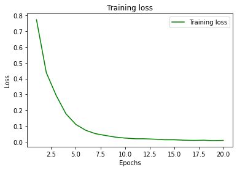
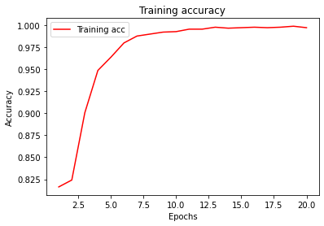

```python
import nltk
nltk.download('vader_lexicon')

import matplotlib.pyplot as plt
import pandas as pd
import numpy as np
import random
from sklearn.model_selection import train_test_split
from keras.utils.np_utils import to_categorical
from sklearn import preprocessing
from keras.preprocessing.text import Tokenizer
from keras import models
from keras import layers
from keras import optimizers
```

    [nltk_data] Downloading package vader_lexicon to
    [nltk_data]     C:\Users\josep\AppData\Roaming\nltk_data...
    [nltk_data]   Package vader_lexicon is already up-to-date!
    

### Keras NN Multiple Classification


```python
df = pd.read_csv('Tweet.csv')
df_up = pd.read_csv('Upsampled.csv')
```


```python
df = df.drop(columns='Unnamed: 0')
```


```python
df.head(5) # normal 
```


<div>
<style scoped>
    .dataframe tbody tr th:only-of-type {
        vertical-align: middle;
    }

    .dataframe tbody tr th {
        vertical-align: top;
    }

    .dataframe thead th {
        text-align: right;
    }
</style>
<table border="1" class="dataframe">
  <thead>
    <tr style="text-align: right;">
      <th></th>
      <th>Tweet</th>
      <th>Platform</th>
      <th>Emotion</th>
      <th>Positive_Bin</th>
    </tr>
  </thead>
  <tbody>
    <tr>
      <th>0</th>
      <td>.@wesley83 I have a 3G iPhone. After 3 hrs twe...</td>
      <td>iPhone</td>
      <td>Negative emotion</td>
      <td>0</td>
    </tr>
    <tr>
      <th>1</th>
      <td>@jessedee Know about @fludapp ? Awesome iPad/i...</td>
      <td>iPad or iPhone App</td>
      <td>Positive emotion</td>
      <td>1</td>
    </tr>
    <tr>
      <th>2</th>
      <td>@swonderlin Can not wait for #iPad 2 also. The...</td>
      <td>iPad</td>
      <td>Positive emotion</td>
      <td>1</td>
    </tr>
    <tr>
      <th>3</th>
      <td>@sxsw I hope this year's festival isn't as cra...</td>
      <td>iPad or iPhone App</td>
      <td>Negative emotion</td>
      <td>0</td>
    </tr>
    <tr>
      <th>4</th>
      <td>@sxtxstate great stuff on Fri #SXSW: Marissa M...</td>
      <td>Google</td>
      <td>Positive emotion</td>
      <td>1</td>
    </tr>
  </tbody>
</table>
</div>


```python
df_up = df_up.drop(columns='Unnamed: 0')
```


```python
df_up.head(5) # upsampled for increased number of negative tweets
```


<div>
<style scoped>
    .dataframe tbody tr th:only-of-type {
        vertical-align: middle;
    }

    .dataframe tbody tr th {
        vertical-align: top;
    }

    .dataframe thead th {
        text-align: right;
    }
</style>
<table border="1" class="dataframe">
  <thead>
    <tr style="text-align: right;">
      <th></th>
      <th>Tweet</th>
      <th>Platform</th>
      <th>Emotion</th>
      <th>Positive_Bin</th>
    </tr>
  </thead>
  <tbody>
    <tr>
      <th>0</th>
      <td>At #sxsw #tapworthy iPad Design Headaches - av...</td>
      <td>iPad</td>
      <td>Negative emotion</td>
      <td>0</td>
    </tr>
    <tr>
      <th>1</th>
      <td>RT @mention Part of Journalsim is the support ...</td>
      <td>NaN</td>
      <td>Negative emotion</td>
      <td>0</td>
    </tr>
    <tr>
      <th>2</th>
      <td>Fuck the iphone! RT @mention New #UberSocial f...</td>
      <td>iPhone</td>
      <td>Negative emotion</td>
      <td>0</td>
    </tr>
    <tr>
      <th>3</th>
      <td>#SXSW 2011: Novelty of iPad news apps fades fa...</td>
      <td>iPad</td>
      <td>Negative emotion</td>
      <td>0</td>
    </tr>
    <tr>
      <th>4</th>
      <td>New #SXSW rule: no more ooing and ahing over y...</td>
      <td>iPad</td>
      <td>Negative emotion</td>
      <td>0</td>
    </tr>
  </tbody>
</table>
</div>


```python
df.info()
```

    <class 'pandas.core.frame.DataFrame'>
    RangeIndex: 3548 entries, 0 to 3547
    Data columns (total 4 columns):
     #   Column        Non-Null Count  Dtype 
    ---  ------        --------------  ----- 
     0   Tweet         3548 non-null   object
     1   Platform      3191 non-null   object
     2   Emotion       3548 non-null   object
     3   Positive_Bin  3548 non-null   int64 
    dtypes: int64(1), object(3)
    memory usage: 111.0+ KB
    


```python
df_up.info()
```

    <class 'pandas.core.frame.DataFrame'>
    RangeIndex: 3500 entries, 0 to 3499
    Data columns (total 4 columns):
     #   Column        Non-Null Count  Dtype 
    ---  ------        --------------  ----- 
     0   Tweet         3500 non-null   object
     1   Platform      3171 non-null   object
     2   Emotion       3500 non-null   object
     3   Positive_Bin  3500 non-null   int64 
    dtypes: int64(1), object(3)
    memory usage: 109.5+ KB
    


```python
df_up['Positive_Bin'].value_counts()
```


    1    2500
    0    1000
    Name: Positive_Bin, dtype: int64


```python
from nltk.sentiment.vader import SentimentIntensityAnalyzer
```


```python
sid = SentimentIntensityAnalyzer()
```


```python
df_up['scores'] = df_up['Tweet'].apply(lambda review:sid.polarity_scores(review))
```


```python
df_up['compound'] = df_up['scores'].apply(lambda d:d['compound'])
```


```python
df_up['comp_score'] = df_up['compound'].apply(lambda score: 1 if score >= 0 else 0)
```


```python
df_up.head()
```


<div>
<style scoped>
    .dataframe tbody tr th:only-of-type {
        vertical-align: middle;
    }

    .dataframe tbody tr th {
        vertical-align: top;
    }

    .dataframe thead th {
        text-align: right;
    }
</style>
<table border="1" class="dataframe">
  <thead>
    <tr style="text-align: right;">
      <th></th>
      <th>Tweet</th>
      <th>Platform</th>
      <th>Emotion</th>
      <th>Positive_Bin</th>
      <th>scores</th>
      <th>compound</th>
      <th>comp_score</th>
    </tr>
  </thead>
  <tbody>
    <tr>
      <th>0</th>
      <td>At #sxsw #tapworthy iPad Design Headaches - av...</td>
      <td>iPad</td>
      <td>Negative emotion</td>
      <td>0</td>
      <td>{'neg': 0.153, 'neu': 0.764, 'pos': 0.083, 'co...</td>
      <td>-0.2732</td>
      <td>0</td>
    </tr>
    <tr>
      <th>1</th>
      <td>RT @mention Part of Journalsim is the support ...</td>
      <td>NaN</td>
      <td>Negative emotion</td>
      <td>0</td>
      <td>{'neg': 0.0, 'neu': 0.63, 'pos': 0.37, 'compou...</td>
      <td>0.8796</td>
      <td>1</td>
    </tr>
    <tr>
      <th>2</th>
      <td>Fuck the iphone! RT @mention New #UberSocial f...</td>
      <td>iPhone</td>
      <td>Negative emotion</td>
      <td>0</td>
      <td>{'neg': 0.166, 'neu': 0.834, 'pos': 0.0, 'comp...</td>
      <td>-0.5848</td>
      <td>0</td>
    </tr>
    <tr>
      <th>3</th>
      <td>#SXSW 2011: Novelty of iPad news apps fades fa...</td>
      <td>iPad</td>
      <td>Negative emotion</td>
      <td>0</td>
      <td>{'neg': 0.0, 'neu': 1.0, 'pos': 0.0, 'compound...</td>
      <td>0.0000</td>
      <td>1</td>
    </tr>
    <tr>
      <th>4</th>
      <td>New #SXSW rule: no more ooing and ahing over y...</td>
      <td>iPad</td>
      <td>Negative emotion</td>
      <td>0</td>
      <td>{'neg': 0.083, 'neu': 0.83, 'pos': 0.087, 'com...</td>
      <td>0.0258</td>
      <td>1</td>
    </tr>
  </tbody>
</table>
</div>


```python
from sklearn.metrics import accuracy_score, classification_report, confusion_matrix, plot_confusion_matrix
```


```python
accuracy_score(df_up['Positive_Bin'],df_up['comp_score'])
```


    0.7537142857142857


```python
print(classification_report(df_up['Positive_Bin'],df_up['comp_score']))
```

                  precision    recall  f1-score   support
    
               0       0.61      0.39      0.47      1000
               1       0.79      0.90      0.84      2500
    
        accuracy                           0.75      3500
       macro avg       0.70      0.64      0.66      3500
    weighted avg       0.74      0.75      0.73      3500
    
    


```python
confusion_matrix(df_up['Positive_Bin'],df_up['comp_score'])
```


    array([[ 389,  611],
           [ 251, 2249]], dtype=int64)


```python

```


```python
full_df = pd.read_csv('Full_DF')
```


```python
full_df.head()
```


<div>
<style scoped>
    .dataframe tbody tr th:only-of-type {
        vertical-align: middle;
    }

    .dataframe tbody tr th {
        vertical-align: top;
    }

    .dataframe thead th {
        text-align: right;
    }
</style>
<table border="1" class="dataframe">
  <thead>
    <tr style="text-align: right;">
      <th></th>
      <th>Unnamed: 0</th>
      <th>Tweet</th>
      <th>Platform</th>
      <th>Emotion</th>
      <th>Uncertain</th>
      <th>Negative</th>
      <th>No Emotion</th>
      <th>Positive</th>
    </tr>
  </thead>
  <tbody>
    <tr>
      <th>0</th>
      <td>0</td>
      <td>.@wesley83 I have a 3G iPhone. After 3 hrs twe...</td>
      <td>iPhone</td>
      <td>Negative emotion</td>
      <td>0</td>
      <td>1</td>
      <td>0</td>
      <td>0</td>
    </tr>
    <tr>
      <th>1</th>
      <td>1</td>
      <td>@jessedee Know about @fludapp ? Awesome iPad/i...</td>
      <td>iPad or iPhone App</td>
      <td>Positive emotion</td>
      <td>0</td>
      <td>0</td>
      <td>0</td>
      <td>1</td>
    </tr>
    <tr>
      <th>2</th>
      <td>2</td>
      <td>@swonderlin Can not wait for #iPad 2 also. The...</td>
      <td>iPad</td>
      <td>Positive emotion</td>
      <td>0</td>
      <td>0</td>
      <td>0</td>
      <td>1</td>
    </tr>
    <tr>
      <th>3</th>
      <td>3</td>
      <td>@sxsw I hope this year's festival isn't as cra...</td>
      <td>iPad or iPhone App</td>
      <td>Negative emotion</td>
      <td>0</td>
      <td>1</td>
      <td>0</td>
      <td>0</td>
    </tr>
    <tr>
      <th>4</th>
      <td>4</td>
      <td>@sxtxstate great stuff on Fri #SXSW: Marissa M...</td>
      <td>Google</td>
      <td>Positive emotion</td>
      <td>0</td>
      <td>0</td>
      <td>0</td>
      <td>1</td>
    </tr>
  </tbody>
</table>
</div>


```python
full_df = full_df.drop(columns='Unnamed: 0')
```


```python
full_df.head(10)
full_df = full_df.dropna()
```


```python
tweets = full_df['Tweet']
tokenizer = Tokenizer(num_words=5000)
tokenizer.fit_on_texts(tweets)
sequences = tokenizer.texts_to_sequences(tweets)
print('sequences type: ' , type(sequences))
```

    sequences type:  <class 'list'>
    


```python
one_hot_results = tokenizer.texts_to_matrix(tweets, mode='binary')
print('one_hot_results type:', type(one_hot_results))
```

    one_hot_results type: <class 'numpy.ndarray'>
    


```python
word_index = tokenizer.word_index
print('Found %s unique tokens.' % len(word_index)) 
```

    Found 5963 unique tokens.
    


```python
# Our coded data
print('Dimensions of our coded results:', np.shape(one_hot_results)) 
```

    Dimensions of our coded results: (3291, 5000)
    


```python
print(y.shape)
print(one_hot_results.shape)
```

    (9093, 4, 2)
    (3291, 5000)
    


```python
emotion = full_df['Emotion']

# Initialize
le = preprocessing.LabelEncoder() 
le.fit(emotion)
print('Original class labels:')
print(list(le.classes_))
print('\n')
emotion_cat = le.transform(emotion)  

# If you wish to retrieve the original descriptive labels post production
# list(le.inverse_transform([0, 1, 3, 3, 0, 6, 4])) 

print('New product labels:')
print(emotion_cat)
print('\n')

# Each row will be all zeros except for the category for that observation 
print('One hot labels; 4 binary columns, one for each of the categories.') 
product_onehot = to_categorical(emotion_cat)
print(product_onehot)
print('\n')

print('One hot labels shape:')
print(np.shape(product_onehot))
```

    Original class labels:
    ["I can't tell", 'Negative emotion', 'No emotion toward brand or product', 'Positive emotion']
    
    
    New product labels:
    [1 3 3 ... 1 3 3]
    
    
    One hot labels; 4 binary columns, one for each of the categories.
    [[0. 1. 0. 0.]
     [0. 0. 0. 1.]
     [0. 0. 0. 1.]
     ...
     [0. 1. 0. 0.]
     [0. 0. 0. 1.]
     [0. 0. 0. 1.]]
    
    
    One hot labels shape:
    (3291, 4)
    


```python
random.seed(123)
test_index = random.sample(range(1,3200), 1500)

test = one_hot_results[test_index]
train = np.delete(one_hot_results, test_index, 0)

label_test = product_onehot[test_index]
label_train = np.delete(product_onehot, test_index, 0)

print('Test label shape:', np.shape(label_test))
print('Train label shape:', np.shape(label_train))
print('Test shape:', np.shape(test))
print('Train shape:', np.shape(train))
```

    Test label shape: (1500, 4)
    Train label shape: (1791, 4)
    Test shape: (1500, 5000)
    Train shape: (1791, 5000)
    


```python
from keras.layers import Input, Dense, LSTM, Embedding
from keras.layers import Dropout, Activation, Bidirectional, GlobalMaxPool1D
from keras.models import Sequential
```


```python
# embedding_size = 128
# model.add(Embedding(embedding_size))
# model.add(Dense(16,input_dim=2, activation='relu'))
# model.add(LSTM(8,input_dim=2, activation='relu'))
# model.add(Dense(2, activation='sigmoid'))
# model.compile(loss='binary_crossentropy',
#               optimizer='adam',
#               metrics=['precision'])
# model.summary()
```


```python
# Initialize a sequential model
model = models.Sequential()
# Two layers with relu activation
model.add(layers.Dense(50, activation='relu', input_shape=(5000,)))
model.add(layers.Dense(25, activation='relu'))
model.add(layers.Dense(4, activation='softmax'))
model.compile(optimizer='adam',
              loss='categorical_crossentropy',
              metrics=['acc'])
```


```python
history = model.fit(train,
                    label_train,
                    epochs=20,
                    batch_size=32)
```

    Epoch 1/20
    56/56 [==============================] - 0s 2ms/step - loss: 0.9940 - acc: 0.8064
    Epoch 2/20
    56/56 [==============================] - 0s 2ms/step - loss: 0.4601 - acc: 0.8163
    Epoch 3/20
    56/56 [==============================] - 0s 2ms/step - loss: 0.3160 - acc: 0.8780
    Epoch 4/20
    56/56 [==============================] - 0s 3ms/step - loss: 0.2006 - acc: 0.9437
    Epoch 5/20
    56/56 [==============================] - 0s 2ms/step - loss: 0.1196 - acc: 0.9588
    Epoch 6/20
    56/56 [==============================] - 0s 2ms/step - loss: 0.0732 - acc: 0.9769
    Epoch 7/20
    56/56 [==============================] - 0s 2ms/step - loss: 0.0459 - acc: 0.9889
    Epoch 8/20
    56/56 [==============================] - 0s 2ms/step - loss: 0.0375 - acc: 0.9918
    Epoch 9/20
    56/56 [==============================] - 0s 2ms/step - loss: 0.0245 - acc: 0.9946
    Epoch 10/20
    56/56 [==============================] - 0s 2ms/step - loss: 0.0243 - acc: 0.9944
    Epoch 11/20
    56/56 [==============================] - 0s 2ms/step - loss: 0.0148 - acc: 0.9981
    Epoch 12/20
    56/56 [==============================] - 0s 2ms/step - loss: 0.0159 - acc: 0.9972
    Epoch 13/20
    56/56 [==============================] - 0s 2ms/step - loss: 0.0148 - acc: 0.9980
    Epoch 14/20
    56/56 [==============================] - 0s 2ms/step - loss: 0.0105 - acc: 0.9970
    Epoch 15/20
    56/56 [==============================] - 0s 2ms/step - loss: 0.0091 - acc: 0.9987
    Epoch 16/20
    56/56 [==============================] - 0s 2ms/step - loss: 0.0059 - acc: 0.9995
    Epoch 17/20
    56/56 [==============================] - 0s 2ms/step - loss: 0.0067 - acc: 0.9978
    Epoch 18/20
    56/56 [==============================] - 0s 2ms/step - loss: 0.0083 - acc: 0.9979
    Epoch 19/20
    56/56 [==============================] - 0s 2ms/step - loss: 0.0059 - acc: 0.9995
    Epoch 20/20
    56/56 [==============================] - 0s 2ms/step - loss: 0.0081 - acc: 0.9974
    


```python
history_dict = history.history
```


```python
history_dict.keys()
```


    dict_keys(['loss', 'acc'])


```python
history_dict = history.history
loss_values = history_dict['loss']

epochs = range(1, len(loss_values) + 1)
plt.plot(epochs, loss_values, 'g', label='Training loss')

plt.title('Training loss')
plt.xlabel('Epochs')
plt.ylabel('Loss')
plt.legend()
plt.show()
```


    

    


```python
# Plot the training accuracy vs the number of epochs

acc_values = history_dict['acc'] 

plt.plot(epochs, acc_values, 'r', label='Training acc')
plt.title('Training accuracy')
plt.xlabel('Epochs')
plt.ylabel('Accuracy')
plt.legend()
plt.show()
```


    

    


```python
# Output (probability) predictions for the test set 
y_hat_test = model.predict(test) 
```


```python
# Print the loss and accuracy for the training set 
results_train = model.evaluate(train, label_train)
results_train
```

    56/56 [==============================] - 0s 2ms/step - loss: 0.0057 - acc: 0.9983
    


    [0.0056903669610619545, 0.9983249306678772]


```python
results_test = model.evaluate(test, label_test)
results_test # model predicts on the test data with 81% accuracy. 
```

    47/47 [==============================] - 0s 1ms/step - loss: 1.1781 - acc: 0.8153
    


    [1.1780710220336914, 0.8153333067893982]


```python

```
